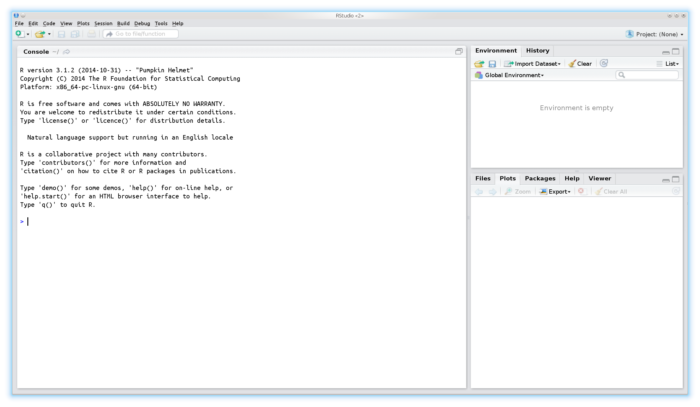
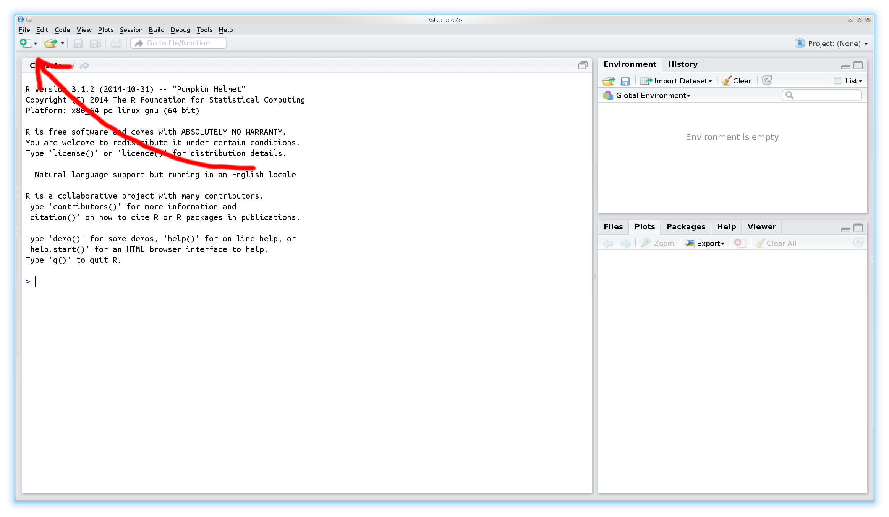
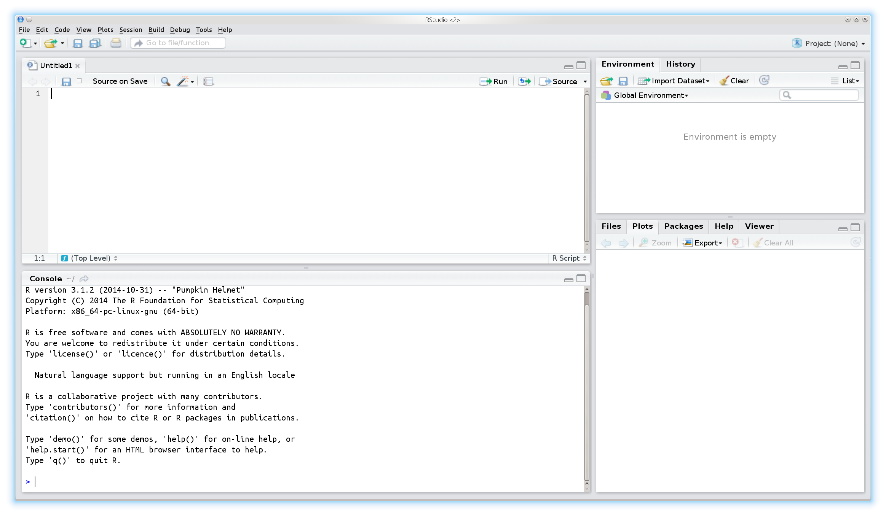

## Overview

1. Introduction

2.

---

## History of R

* R was started by Ross Ihaka and Robert Gentleman (the ”R & R’s” of the University of Auckland) in 1992.

* R is an environment and language for data manipulation, calculation and graphical display.

* R is published under GNU licence. This means it is an open source program and is distributed for free.

* R can be seen as an implementation or dialect of the S language. S was developed by Becker and Chambers 1984.

* The origin of the name is not known anymore (although there are obvious possibilities...).

---

## Why to use R?

* It is _easy_. Compared to real programming languages, R has a simplified syntax that can be used without big learning efforts.

* It is _open source_. This means you can alter or check every piece of code (or hope at least that someone else does it...).

* It is _friendly_. Usually the mailing lists (”Rhelp”) or online discussion forums (e.g. 'StackOverflow') are fast, friendly and helpful.

* It is an _universal tool_. Usually there is a function in R for everything, or if there isn’t, soon there will be.

---

## Why not to use R?

* It is _difficult_. Compared to graphical-interface based tools like Excel a console might be shocking and repellent.

* It is _open source_. This means, you have to trust the functions are correct - but noone gives you a warranty for this. Use it on own risk!

* It is _hostile_. Mailing lists (”Rhelp”) or online discussion forums (e.g. 'StackOverflow') don’t like reocurring questions or questions showing no own efforts to solve a problem.

* It is _static_. These days the figures are too static compared to other, competing languages like Matlab. You hardly can interact with created figures.

* It is _slow_. Compared to real programming languages, R is slow (the price for being easy...), but C,C++ and other languages can be included into R programs to boost the speed.

---

## Where to get R?

* R is pre-compiled available for every common operating system, like Windows, Linux and Mac , and also for 32 and 64bit.

* It can be downloaded from the CRAN (”Comprehensive R Archive Network”) webpage: [http://cran.r-project.org] (http://cran.r-project.org).

* Usually there are 2-3 major updates per year.

* Linux user that use the apt package system, can include the CRAN server into it and receive those updates then automatically.

* On CRAN are also thousands of additional extensions (”packages”) available.

* The [Bioconductor] (https://www.bioconductor.org/) projects offers on top of that also hundreds of packages specialized for genomic data analysis.

---

## How does R look like?

---

## How to use a console?

* The symbol that 'waits' for the input is usually the > sign.

* One usually types the command there and sends it to the interpreter by pressing the Return key.

* If a command line starts with + instead of > the interpreter expects further input.

* Common reason for this are still open parantheses or quotations.

* A history of the last commands is accesible using the arrow keys ↑↓.

* The console is case-sensitive.

---

## How to start?

---

## How to start?

---

## The script window

* Using the console is alright for simple commands, but as soon as you apply a sequence of commands it gets messy

* For larger projects (e.g. analysing datasets) it is much more convenient to write and run a _script_.

* This has the advantage that the commands can easily be stored, changed and distributed.

* It is much easier to keep the overview over the project.

* It is easier to prepare the script and run it then as whole.

* Copy+Paste for similar tasks

---

## A typical workflow in R

1. Open the data with a (good...) text editor or Excel and inspect its properties:

  a. Is the first line a _header-line_?

  b. What is the separator between the columns?

2. Import the data to R

3. Apply some data transformation and calculate desired statistics

4. Visualize the results

5. Store all results

