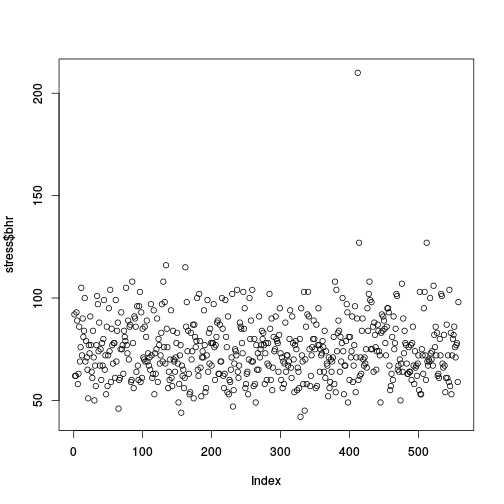
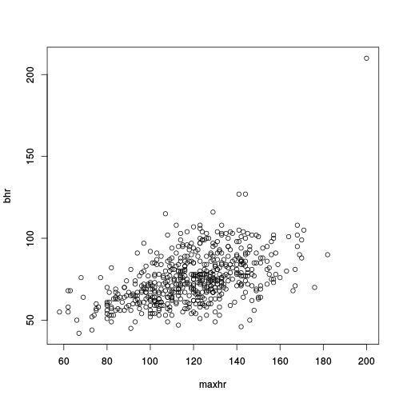
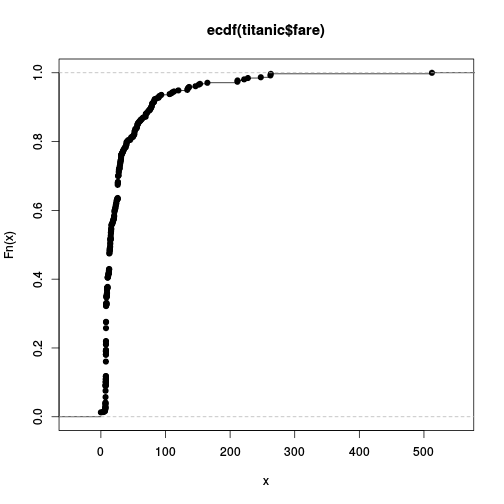
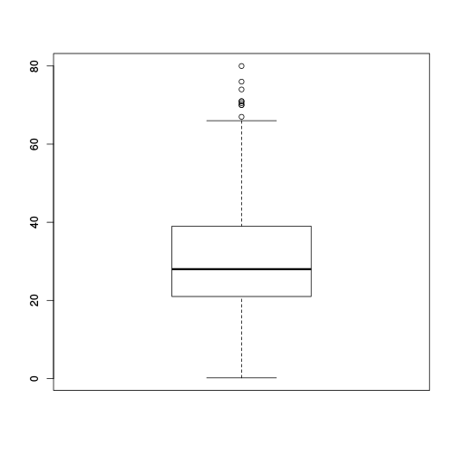
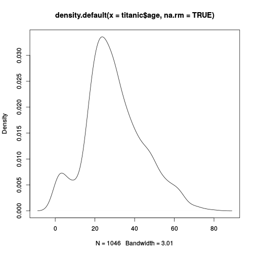
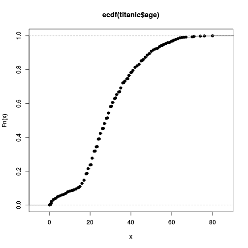
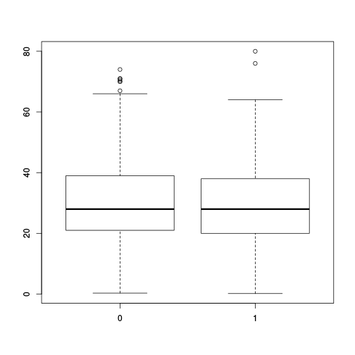
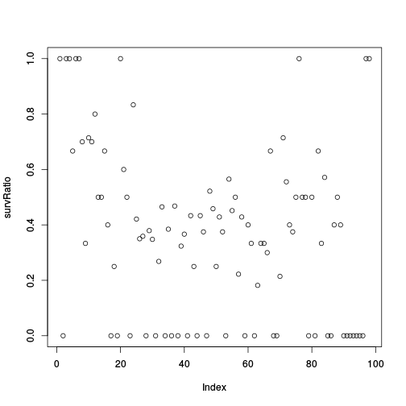
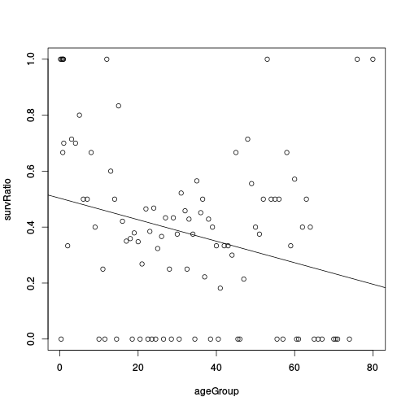

## Overview

1. Introduction
2. Import Data to R
3. Data Structures
4. R as Pocket Calculator and basics
5. Packages ("Add-Ons")
6. Plots
7. Statistical Models and Tests
8. Export Data and Figures

---

## History of R

* R was started by Ross Ihaka and Robert Gentleman (the ”R & R’s” of the University of Auckland) in 1992.

* R is an environment and language for data manipulation, calculation, graphical display and statistical analysis.

* R is published under GNU licence. This means it is an open source program and is distributed for free.

* R can be seen as an implementation or dialect of the S language. S was developed by Becker and Chambers 1984.

* The origin of the name is not known anymore (although there are obvious possibilities...).

---

## Why to use R?

* It is _easy_. Compared to real programming languages, R has a simplified syntax that can be used without big learning efforts.

* It is _open source_. This means you can alter or check every piece of code (or hope at least that someone else does it...).

* It is _friendly_. Usually the mailing lists (”Rhelp”) or online discussion forums (e.g. 'StackOverflow') are fast, friendly and helpful.

* It is an _universal tool_. Usually there is a function in R for everything, or if there isn’t, soon there will be.

* Good environment for sharing your analysis tools.

---

## Why not to use R?

* It is _difficult_. Compared to graphical-interface based tools like Excel a console might be shocking and repellent.

* It is _open source_. This means, you have to trust the functions are correct - but noone gives you a warranty for this. Use it on own risk!

* It is _hostile_. Mailing lists (”Rhelp”) or online discussion forums (e.g. 'StackOverflow') don’t like reocurring questions or questions showing no own efforts to solve a problem.

* It is _static_. These days the figures are too static compared to other, competing languages like Matlab. You hardly can interact with created figures.

* It is _slow_. Compared to real programming languages, R is slow (the price for being easy...), but C,C++ and other languages can be included into R programs to boost the speed.

---

## Where to get R?

* R is pre-compiled available for every common operating system, like Windows, Linux and Mac , and also for 32 and 64bit.

* It can be downloaded from the CRAN (”Comprehensive R Archive Network”) webpage: [http://cran.r-project.org] (http://cran.r-project.org).

* Usually there are 2-3 major updates per year.

* Linux user that use the apt package system, can include the CRAN server into it and receive those updates then automatically.

* On CRAN are also thousands of additional extensions (”packages”) available.

* The [Bioconductor] (https://www.bioconductor.org/) projects offers on top of that also hundreds of packages specialized for genomic data analysis.

* It should be possible for everyone (Windows users) in Luke to download R and RStudio from [Application Catalog]
(http://vancmss1/CMApplicationCatalog/#/SoftwareLibrary/AppListPageView.xaml) which is also found under the star
in the upper right corner of IE window


---

## How does R look like?


---

## How to use a console?

* The symbol that 'waits' for the input is usually the > sign.

* One usually types the command there and sends it to the interpreter by pressing the Return key.

* If a command line starts with + instead of > the interpreter expects further input.

* Common reason for this are still open parantheses or quotations.

* A history of the last commands is accesible using the arrow keys ↑↓.

* The console is case-sensitive.

---

## How to start?


---

## How to start?


---

## The script window

* Using the console is alright for simple commands, but as soon as you apply a sequence of commands it gets messy

* For larger projects (e.g. analysing datasets) it is much more convenient to write and run a _script_.

* This has the advantage that the commands can easily be stored, changed and distributed.

* It is much easier to keep the overview over the project.

* It is easier to prepare the script and run it then as whole.

* Copy+Paste for similar tasks

---

## Demonstration of a typical R-Session

* Lets have a look on how a R session typically goes.

* The example situation is that we received from a colleague an R script that performs a certain
     analysis and we want to run it on our computer
     
* We will run into an error and fix it

* We run the analysis, save the results and end the session.

* (I'll add here later a YouTube Video that will demonstrate the same steps.)

---

## Where to get help?

* For each function in R exists a help file, that can be accessed with `?`
  This means, in order to get the help for the function foo type `?foo` into the console.

* If you forgot a function name but have a wild guess how it was, the `apropos()` command is usefull.
  In order to check for all commands that contain the word ’test’ type `apropos("test")`.

* Of course Google is always a good place to search 

* A very helpful online ressource is also http://www.stackoverflow.com


---

## A typical workflow in R

1. Open the data with a (good...) text editor or Excel and inspect its properties:

  a. Is the first line a _header-line_?

  b. What is the separator between the columns?

2. Import the data to R

3. Apply some data transformation and calculate desired statistics

4. Visualize the results

5. Store all results

--- .segue .dark

## Import Data to R

---

## Working directory I

* The term ’working directory’ refers in R to the place on the hard drive, where R looks for files, stores Figures etc.

* All paths and filenames that are given relative to this specific location.

* Of course it is possible to check and change this location. 

* A typical workflow of a project is that in the beginning the working directory is set to the project folder on the hard drive.

* The command to check the working directory is `getwd()` and the one for setting it is `setwd()`.

---

## Working directory II

* An example how the working directory is extracted and set using windows:


```r
getwd()
> [1] "C:/Program Files/R/R-3.0.2"
setwd("C:/temp/")
getwd()
> [1] "C:/temp"
```

* The file system is a bit different in Linux, a typical path looks there like
/home/ejo123/myProjects.

---

## Import ASCII files I

* Datasets that are imported to R are typically given in ASCII format. .

* Other formats are possible, but I'd recommend to stay with ASCII/text files.

ASCII is a plain text format and common file extensions are .txt or .csv. Before reading
files into R it is advisable to open them first with a text editor in order to
check the properties of the files. One should focus especially on the
following things:

1. What is the column separator (Whitespace, comma, tab, etc.)?

2. Is the first line a data line or does it contain the variable names?

3. Are real numbers given with comma or point (e.g. is it 5,25 or 5.25)?

4. How is missing data encoded (e.g. NA, dot, whitespace)?

---

## Import ASCII files II

In order to read an ASCII file to R, we perform the following steps:

1. Set the working directory to the path where the data is located.

2. Check for above mentioned properties

3. Read the data and assign it to an object. The command is


```r
myData <- read.table(file="theData.txt", header=FALSE, sep="\t")
```

In this case the first line contained already data (If the first line are the
variable names, the option is `header=TRUE`) and the columns are
separated with TAB (\t is the so-called escape-seqence for TAB, other
separators are usually given as they are.)

---

## Import ASCII files III

Overview of important import options in `read.table()`:

* `sep` What is the column separator? Typical values are: `","`, `";"`, `" "`, `"\t"`

* `header` Logical, contains the first row variable names or not? Possible values:`TRUE`, `FALSE`

* `na.string` How are missing values encoded in the ASCII file? Typical values: `NA`, `"."`
  Internally in R, they are always encoded as `NA`.

* `dec` What is used as decimal symbol?

* `as.is` Logical, shall R try to predict the ’right’ data format?

* `colclasses` Vector of predefined column classes.

* `stringsAsFactors` Logical, handle strings as factors?

---

## Import ASCII files IV

The `read.table` command is a function that is very user-friendly and that handles most standard data formats.

However, in situations when the data is not in an easy-to-access format, the command `scan()` might be usefull to
read-in such data.

Another useful command is `readLines()` that reads in Line-by-Line.


---

## Import other files to R

Other file formats can also be imported to R, but it usually requires more
efforts.

There are functions that read, e.g. Excel tables, but it is not very
advisable to use them, as those data formats are usually proprietary and
hence developers cannot provide full functionality. The easiest way to
import an Excel sheet to R is to open it with Excel, save it as csv file
and proceed as above mentioned.

Another way to import data is to connect directly to a MySQL database,
but this is above the scope of the course and will be discussed in an
advanced course.

Also, html pages can be access directly (e.g. data download directly from wikipedia and such things.)

---

## Example data

* You can download example data from here:
   [Titanic-data](https://raw.githubusercontent.com/fischuu/fischuu.github.io/master/lectures/IntroductionToR/data/titanic3.csv)
   [stressEcho](https://raw.githubusercontent.com/fischuu/fischuu.github.io/master/lectures/IntroductionToR/data/stressEcho.csv)

* Just Right-click, choose 'Save as' and store them on your HDD.

* These datasets we will use throughout the whole course to learn the different methods.

"Data obtained from [http://biostat.mc.vanderbilt.edu/DataSets] (http://biostat.mc.vanderbilt.edu/DataSets)".

* The Datasets contain plenty of variables, we won't use all of them.

---

## Titanic passenger information variables:

1. pclass (Passenger class)
2. survived (yes=1, no=0)
3. name 
4. sex (female/male)  	
5. age 
6. sibsp	(Number of Siblings/Spouses Aboard)
7. parch	(Number of Parents/Children Aboard)
8. ticket	(Ticket Number)		
9. fare	(Passenger Fare	British Pound)
10. cabin	(Cabin number)		

---

## Titanic passenger information variables (continued):

11. embarked	(S, Q, C=)
12. boat			
13. body	Body Identification Number		
14. home.dest	Home/Destination


---

## Stress echo data

1. bhr	Basal heart rate	(bpm) integer
2. basebp	Basal blood pressure	mmHg integer
3. basedp	Basal Double Product bhr TIMES basebp	 bpm TIMES mmHg	integer
4. pkhr	Peak heart rate	mmHg	integer
5. sbp	Systolic blood pressure	mmHg integer
6. dp	Double product pkhrTIMESsbp	bpm TIMES mmHg integer
7. dose	Dose of dobutamine given	mg	integer
8. maxhr	Maximum heart rate	bpm	integer
9. pctMphr	Percent maximum predicted heart rate achieved	%	integer
10. mbp	Maximum blood pressure	mmHg integer
11. dpmaxdo	Double product on max dobutamine dose	bpm TIMES mmHg integer
12. dobdose	Dobutamine dose at max double product	mg	integer
13. age	Age	years	integer

---

## Stress echo data (continued)

14. gender 2 character
15. baseEF	Baseline cardiac ejection fraction	%	integer
16. dobEF	Ejection fraction on dobutamine	%	integer
17. chestpain	Chest pain		integer
18. restwma	Resting wall motion abnormality on echocardiogram		integer
19. posSE	Positive stress echocardiogram		integer
20. newMI	New myocardial infarction		integer
21. newPTCA	Recent angioplasty		integer
22. newCABG	Recent bypass surgery	integer
23. death			integer
24. hxofHT	History of hypertension		integer
25. hxofDM	History of diabetes		integer
26. hxofCig	History of smoking		3 integer

---

## Stress echo data (continued)

27. hxofMI	History of myocardial infarction		integer
28. hxofPTCA	History of angioplasty		integer
29. hxofCABG	History of coronary artery bypass surgery		integer
30. any.event	Death, newMI, newPTCA, or newCABG		integer
31. ecg	Baseline electrocardiogram diagnosis		3 integer


--- 

## Hands-on: Import the Example data

1. After having downloaded the titanic data, import it to R and name it `titanic`

2. After having downloaded the stress echo data, import it to R and name it `stress`


(If you have your own data, try it to import it to R and give it a reasonable name)

---

## Hint

1. Open the file in a text editor (if you use Word, DON'T save it). I suggest to install Notepad++ and use this as a text editor instead of Notepad ord Wordpad

2. Check the first line, is a header present or not?

3. How are the different cells separated?

---

## Solution: Import the Titanic data


```r
setwd("/home/ejo138/Projects/lectures/IntroductionToR")
titanic <- read.table("titanic3.csv", sep=",", header=TRUE)
stress <- read.table("stressEcho.csv", sep=",", header=TRUE)
```


---

## The R workspace I

As already mentioned now several times, everything is considered to be an
object in R. These objects are living in the so-called workspace. The
workspace in R is comparable with a desk. The content of this
workspace/desk can be shown with the command


```r
ls()
```

```
[1] "stress"  "titanic"
```

The `ls()` command shows all active R objects, unneeded objects can be
removed via `rm()` command. Assuming we have an object foo we can
remove it be typing

```r
rm(foo)
```
and all objects of a workspace can removed by (DANGEROUS!!!)

```r
rm(list=ls())
```

---

## The R workspace II

One can store the entire workspace and restore it later on. For that are the
commands `save.image()` and the `load()`command available.
If one want to save a workspace the command is

```r
save.image(file="myRsession.RData")
```

Note that RStudio usually saves the workspace when quitting the session.

One can load the workspace via


```r
load(file="myRsession.RData")
```

This is especially then usful when one works on different projects where the calculations
take a while and cannot be easily repeated.

---

## How to continue

* After importing the data to R, the first step is to check if the data was imported properly!

* It is a common source of error to import the data wrongly without noticing it in the first place!

* But how to check if the data was imported properly? For that some background of R's data types and data structures is needed.

* Each (data) object in a programming language is of a certain type and is handled different.

* R knows basically 5 different data types:

1. The empty set. Example: `NULL`. Name: NULL.
2. Logical values. Example: `TRUE`. Name: logical.
3. Real values. Example: `3.13` or `4`. Name: numeric.
4. Complex values. Example: `5.22+1i`. Name: complex.
5. Letters and strings. Example: `"Hei hei"`. Name: character.

--- .segue .dark

## Data structures

---

## Standard data formats I

* In R everything is an object.

* Although R isn't a classical object orientated programming language, we use this term here.

* Values can be stored in variables.

* Variables can be of very different type and have very different properties, depending on the purpose for what we need them!

* Also functions return objects (also here are different types possible).

* __Question__: What for do I need these variables and how do I use them?!

---

## Standard data formats II

The standard data objects for numbers (numeric) and strings (character) are

1. `vector`
2. `matrix` or `data.frame`
3. `list`
4. `array`
5. `factor`
6. `(function)`

* Each data structure has it’s own properties and we are going through them soon.

* The main idea of a data structure is to store the previous result and make it later accessible!

---

## Data structure: Vector

* The vector structure is similar to vectors known from mathematics.

* You can compare vectors with houses along a street.

* There is clearly defined how many houses there are (= length of the vector).

* Each house has it’s clear position that can be addressed.

* The only difference is, at each postion only one element is allowed and all elements have to be the same type. (This is then the difference to a real street, hopefully!)

---

## Data structure: Vector II

* A vector in R is a sequence of elements that have all the same mode. 

* The easiest way to create a vector is using the `c()` function. 

* The function is used as follows:


```r
vectorname <- c(value1, value2, ...)
```

* A single number is also treated like a vector but can be easier assigned to an object:

```r
vectorname <- value1
```

---

## Data structures: Vector III

* Let’s assign some values:

```r
 peter.height <- 190
 paul.height <- 188
 kati.height <- 179
```

* These are now special type of vectors, because they have just length 1! 

* Let’s combine now these special vectors:


```r
all.height <- c(peter.height, paul.height, kati.height)
heights <- c(190, 188, 179)
```

---

## Data structures: Vector IV

* Just by typing the name of an object (here the vector) into the console, R displays its content.


```r
all.height
```

```
[1] 190 188 179
```

```r
heights
```

```
[1] 190 188 179
```

---

## Data structure: Vector V

* As mentioned in the street example, each position in a vector can be
addressed:

```r
 heights[1]
```

```
[1] 190
```

```r
 all.height[3]
```

```
[1] 179
```

We can also see the length of a vector:


```r
length(heights)
```

```
[1] 3
```

---

## Data structure: matrix I

* The matrix structure is also similar to matrices known from mathematics.

* You can compare them with a chessboard.

* There is clear defined how many fields there are (= 'product of the edges').

* Each cell has it’s clear position that can be addressed.

* The only difference (to a chessboard...) is also here all elements have to be the same type and it can be rectangular, with arbitrary sizes.

---

## Data structure: matrix II (create matrices)

* Matrices are filled using vectors:


```r
 myMatrix <- matrix(c(1,2,3,4,5,6), ncol=3)
 myMatrix
```

```
     [,1] [,2] [,3]
[1,]    1    3    5
[2,]    2    4    6
```

```r
 myMatrix2 <- matrix(c(1,2,3,4,5,6), ncol=3, byrow=TRUE)
 myMatrix2
```

```
     [,1] [,2] [,3]
[1,]    1    2    3
[2,]    4    5    6
```

---

## Data structure: matrix III (get dimensions)


```r
 nrow(myMatrix)
```

```
[1] 2
```

```r
 ncol(myMatrix)
```

```
[1] 3
```

```r
 length(myMatrix)
```

```
[1] 6
```

```r
 dim(myMatrix)
```

```
[1] 2 3
```

---

## Data structure: matrix IV

* In order to access specific elements in a matrix, we have to give 2 positions, or the column/row number of interest


```r
 myMatrix[1,3]
```

```
[1] 5
```

```r
 myMatrix[2,]
```

```
[1] 2 4 6
```

```r
 myMatrix[,1]
```

```
[1] 1 2
```

---

## Data structure: matrix V

We can also change certain entries in the matrix


```r
 myMatrix[1,3] <- 100
 myMatrix
```

```
     [,1] [,2] [,3]
[1,]    1    3  100
[2,]    2    4    6
```

```r
 myMatrix[1,] <- c(5,9,2)
 myMatrix
```

```
     [,1] [,2] [,3]
[1,]    5    9    2
[2,]    2    4    6
```

---

## Data structure: matrix VI

We can also change certain entries in the matrix


```r
 myMatrix[,2] <- c(7,3)
 myMatrix
```

```
     [,1] [,2] [,3]
[1,]    5    7    2
[2,]    2    3    6
```

---

## Interruption

It is already time to review some things that happened here!

1. We saw that basically everything happened by using functions. The general syntax was:


```r
Functionname(Argument)
```

2. We saw also that all functions return objects, e.g. the command to
get the number of rows of matrix `nrow()` gives a vector of length 1
with the result.

3. As a special command we had the `matrix()` command. Maybe you
have noticed that it took 2 arguments as input! These arguments
have been separated by comma and we will see this more frequent in
the future!

---

## Hands-On: Assigning values

1. Assign values 4, 6 and 12 to the object `test`
2. Change the second element of `test` then to 14
3. Create a matrix testMat that looks like this:


```r
testMat
```

```
     [,1] [,2]
[1,]    5    3
[2,]    6   12
```

4. Display the second column of the matrix testMat

---

## Hands-On: Solutions 1&2

1. Assign values 4, 6 and 12 to the object `test`


```r
 test <- c(4,6,12)
 test
```

```
[1]  4  6 12
```

2. Change the second element of `test` then to 14


```r
 test[2] <- 14
 test
```

```
[1]  4 14 12
```

---
## Hands-On: Solutions 3&4

3. Create a matrix testMat that looks like this:


```r
 testMat <- matrix(c(5,3,6,12),ncol=2)
 testMat
```

```
     [,1] [,2]
[1,]    5    6
[2,]    3   12
```

4. Display the second column of the matrix testMat


```r
 testMat[,2]
```

```
[1]  6 12
```

---
## Different data types in a vector
So far we introduced vectors and matrices but used numbers in it. Well,
what about text?! In categorical data text objects are commonly used,
different sequences might be non-numerical coded, gene names, etc.
Text (or better ’strings’) are identified with quotations:

```r
 myString <- "Peter Pan"
 myString
```

```
[1] "Peter Pan"
```
 
But what happens now, when we combine strings and numbers?!
Remember, I said earlier, in matrices and vectors are only same object
types allowed.


```r
myNewString <- c(myString,"Robin Hood",123)
myNewString
```

```
[1] "Peter Pan"  "Robin Hood" "123"       
```

---

## Data structure: data.frame I

One data structure that overcomes the limitation that all elements have to
be of the same class is the data.frame:


```r
 myDF <- data.frame(height = c(190, 187, 178),
                    name = c("Peter", "Paul", "Kati"))
 myDF
```

```
  height  name
1    190 Peter
2    187  Paul
3    178  Kati
```

---
## Data structure: data.frame II

data.frame are practically vectors of same length that are organized in a matrix similar shape.


```r
 myDF[,1]
```

```
[1] 190 187 178
```

```r
 myDF[,2]
```

```
[1] Peter Paul  Kati 
Levels: Kati Paul Peter
```

---

## Data structure: factor I

We saw already the next type of data structure / type: the factor
type. It is especially used for categorical data or status information like
male / female, placebo / drug. etc.
Possible values are called here levels. All levels from such a data
structure can then be shown via


```r
 levels(myDF[,2])
```

```
[1] "Kati"  "Paul"  "Peter"
```

One has to be very careful with factors, as they might behave not in such
a way as one would always assume! They are highly controversial, some R-users
love them, some hate them, and some accept them.

Depending on your tasks, `factors` can be extremly helpful or be the source of
error. By default, R imports all `strings` as `factor`. It is adviceable to
make your own experciences, if you like them or not.

---

## Data structure: factor II

By default R interprets strings as factors. This behaviour can be changed
using the additional option stringsAsFactors:


```r
 myDF <- data.frame(height = c(190, 187, 178),
                   name = c("Peter", "Paul", "Kati"),
                   stringsAsFactors=FALSE)
 myDF
```

```
  height  name
1    190 Peter
2    187  Paul
3    178  Kati
```

---

## Data structure: factor II


```r
 myDF[,1]
```

```
[1] 190 187 178
```

```r
 myDF[,2]
```

```
[1] "Peter" "Paul"  "Kati" 
```

---

## Our data example

* Lets come back to our data example.

* Earlier we imported the two datsets `titanic` and `stressEcho`.

* Back then we said we have to check, if they have been properly imported, we can do this now!


```r
 stress[1:6,1:12]
```

```
  X bhr basebp basedp pkhr sbp    dp dose maxhr pctMphr mbp dpmaxdo
1 1  92    103   9476  114  86  9804   40   100      74 121   12100
2 2  62    139   8618  120 158 18960   40   120      82 158   18960
3 3  62    139   8618  120 157 18840   40   120      82 157   18840
4 4  93    118  10974  118 105 12390   30   118      72 105   12390
5 5  89    103   9167  129 173 22317   40   129      69 176   22704
6 6  58    100   5800  123 140 17220   40   123      83 140   17220
```

---

## Our data example: (structure)

```r
 str(stress)
```

```
'data.frame':	558 obs. of  32 variables:
 $ X        : int  1 2 3 4 5 6 7 8 9 10 ...
 $ bhr      : int  92 62 62 93 89 58 63 86 69 76 ...
 $ basebp   : int  103 139 139 118 103 100 120 161 143 105 ...
 $ basedp   : int  9476 8618 8618 10974 9167 5800 7560 13846 9867 7980 ...
 $ pkhr     : int  114 120 120 118 129 123 98 144 115 126 ...
 $ sbp      : int  86 158 157 105 173 140 130 157 118 125 ...
 $ dp       : int  9804 18960 18840 12390 22317 17220 12740 22608 13570 15750 ...
 $ dose     : int  40 40 40 30 40 40 40 40 40 40 ...
 $ maxhr    : int  100 120 120 118 129 123 98 144 113 126 ...
 $ pctMphr  : int  74 82 82 72 69 83 71 111 81 94 ...
 $ mbp      : int  121 158 157 105 176 140 130 157 151 125 ...
 $ dpmaxdo  : int  12100 18960 18840 12390 22704 17220 12740 22608 17063 15750 ...
 $ dobdose  : int  40 40 40 30 40 40 40 40 40 40 ...
 $ age      : int  85 73 73 57 34 71 81 90 81 86 ...
 $ gender   : Factor w/ 2 levels "female","male": 2 2 2 1 2 2 1 1 1 2 ...
 $ baseEF   : int  27 39 39 42 45 46 48 50 52 52 ...
 $ dobEF    : int  32 40 40 57 57 57 54 57 62 62 ...
 $ chestpain: int  0 0 0 0 1 0 1 0 0 0 ...
 $ restwma  : int  0 0 0 0 1 0 0 0 1 0 ...
 $ posSE    : int  0 0 0 0 0 0 0 0 0 0 ...
 $ newMI    : int  0 1 1 0 0 0 0 0 0 0 ...
 $ newPTCA  : int  0 0 0 0 0 0 0 0 0 0 ...
 $ newCABG  : int  0 0 0 0 0 0 0 0 0 0 ...
 $ death    : int  0 0 0 0 0 0 0 0 0 0 ...
 $ hxofHT   : int  0 0 0 0 0 0 0 0 0 0 ...
 $ hxofDM   : int  0 1 1 0 0 0 0 0 0 0 ...
 $ hxofCig  : Factor w/ 3 levels "heavy","moderate",..: 3 3 3 3 3 3 3 3 3 3 ...
 $ hxofMI   : int  1 1 1 0 0 1 1 0 0 0 ...
 $ hxofPTCA : int  1 0 0 0 0 0 0 0 0 0 ...
 $ hxofCABG : int  0 0 0 0 0 1 0 0 0 0 ...
 $ any.event: int  0 1 1 0 0 0 0 0 0 0 ...
 $ ecg      : Factor w/ 3 levels "equivocal","MI",..: 3 1 1 3 1 3 1 1 3 3 ...
```

---

## Our data example (summary)

```r
 summary(stress)
```

```
       X              bhr             basebp          basedp     
 Min.   :  1.0   Min.   : 42.00   Min.   : 85.0   Min.   : 5000  
 1st Qu.:140.2   1st Qu.: 64.00   1st Qu.:120.0   1st Qu.: 8400  
 Median :279.5   Median : 74.00   Median :133.0   Median : 9792  
 Mean   :279.5   Mean   : 75.29   Mean   :135.3   Mean   :10181  
 3rd Qu.:418.8   3rd Qu.: 84.00   3rd Qu.:150.0   3rd Qu.:11663  
 Max.   :558.0   Max.   :210.00   Max.   :203.0   Max.   :27300  
      pkhr            sbp              dp             dose      
 Min.   : 52.0   Min.   : 40.0   Min.   : 5100   Min.   :10.00  
 1st Qu.:106.2   1st Qu.:120.0   1st Qu.:14033   1st Qu.:30.00  
 Median :122.0   Median :141.0   Median :17060   Median :40.00  
 Mean   :120.6   Mean   :146.9   Mean   :17634   Mean   :33.75  
 3rd Qu.:135.0   3rd Qu.:170.0   3rd Qu.:20644   3rd Qu.:40.00  
 Max.   :210.0   Max.   :309.0   Max.   :45114   Max.   :40.00  
     maxhr          pctMphr            mbp           dpmaxdo     
 Min.   : 58.0   Min.   : 38.00   Min.   : 84.0   Min.   : 7130  
 1st Qu.:104.2   1st Qu.: 69.00   1st Qu.:133.2   1st Qu.:15260  
 Median :120.0   Median : 78.00   Median :150.0   Median :18118  
 Mean   :119.4   Mean   : 78.57   Mean   :156.0   Mean   :18550  
 3rd Qu.:133.0   3rd Qu.: 88.00   3rd Qu.:175.8   3rd Qu.:21239  
 Max.   :200.0   Max.   :133.00   Max.   :309.0   Max.   :45114  
    dobdose           age           gender        baseEF    
 Min.   : 5.00   Min.   :26.00   female:338   Min.   :20.0  
 1st Qu.:20.00   1st Qu.:60.00   male  :220   1st Qu.:52.0  
 Median :30.00   Median :69.00                Median :57.0  
 Mean   :30.24   Mean   :67.34                Mean   :55.6  
 3rd Qu.:40.00   3rd Qu.:75.00                3rd Qu.:62.0  
 Max.   :40.00   Max.   :93.00                Max.   :83.0  
     dobEF         chestpain         restwma           posSE       
 Min.   :23.00   Min.   :0.0000   Min.   :0.0000   Min.   :0.0000  
 1st Qu.:62.00   1st Qu.:0.0000   1st Qu.:0.0000   1st Qu.:0.0000  
 Median :67.00   Median :0.0000   Median :0.0000   Median :0.0000  
 Mean   :65.24   Mean   :0.3082   Mean   :0.4606   Mean   :0.2437  
 3rd Qu.:73.00   3rd Qu.:1.0000   3rd Qu.:1.0000   3rd Qu.:0.0000  
 Max.   :94.00   Max.   :1.0000   Max.   :1.0000   Max.   :1.0000  
     newMI            newPTCA           newCABG            death        
 Min.   :0.00000   Min.   :0.00000   Min.   :0.00000   Min.   :0.00000  
 1st Qu.:0.00000   1st Qu.:0.00000   1st Qu.:0.00000   1st Qu.:0.00000  
 Median :0.00000   Median :0.00000   Median :0.00000   Median :0.00000  
 Mean   :0.05018   Mean   :0.04839   Mean   :0.05914   Mean   :0.04301  
 3rd Qu.:0.00000   3rd Qu.:0.00000   3rd Qu.:0.00000   3rd Qu.:0.00000  
 Max.   :1.00000   Max.   :1.00000   Max.   :1.00000   Max.   :1.00000  
     hxofHT           hxofDM             hxofCig        hxofMI     
 Min.   :0.0000   Min.   :0.0000   heavy     :122   Min.   :0.000  
 1st Qu.:0.0000   1st Qu.:0.0000   moderate  :138   1st Qu.:0.000  
 Median :1.0000   Median :0.0000   non-smoker:298   Median :0.000  
 Mean   :0.7043   Mean   :0.3692                    Mean   :0.276  
 3rd Qu.:1.0000   3rd Qu.:1.0000                    3rd Qu.:1.000  
 Max.   :1.0000   Max.   :1.0000                    Max.   :1.000  
    hxofPTCA          hxofCABG        any.event             ecg     
 Min.   :0.00000   Min.   :0.0000   Min.   :0.0000   equivocal:176  
 1st Qu.:0.00000   1st Qu.:0.0000   1st Qu.:0.0000   MI       : 71  
 Median :0.00000   Median :0.0000   Median :0.0000   normal   :311  
 Mean   :0.07348   Mean   :0.1577   Mean   :0.1595                  
 3rd Qu.:0.00000   3rd Qu.:0.0000   3rd Qu.:0.0000                  
 Max.   :1.00000   Max.   :1.0000   Max.   :1.0000                  
```


## Naming of element
* Columns of data.frames can have names that can be accessed with the $ sign.

* Names were taken from the `header`line in the data import step via `read.table`.

* We did the same already earlier, when we had the data.frame. It works there the same way:

* Lets check the first 25 elements of the column named `bhr` in the data.frame `stress`:


```r
 stress$bhr[1:25]
```

```
 [1]  92  62  62  93  89  58  63  86  69  76 105  72  90  81  84 100  69
[18]  79  71  65  51  77  73  91  77
```

---
## Getting the column names of a data.frame

* There are commands to set and get the column names of a matrix or data.frame.

* This is called `colnames()`:


```r
 colnames(stress)
```

```
 [1] "X"         "bhr"       "basebp"    "basedp"    "pkhr"     
 [6] "sbp"       "dp"        "dose"      "maxhr"     "pctMphr"  
[11] "mbp"       "dpmaxdo"   "dobdose"   "age"       "gender"   
[16] "baseEF"    "dobEF"     "chestpain" "restwma"   "posSE"    
[21] "newMI"     "newPTCA"   "newCABG"   "death"     "hxofHT"   
[26] "hxofDM"    "hxofCig"   "hxofMI"    "hxofPTCA"  "hxofCABG" 
[31] "any.event" "ecg"      
```

---
## Summary break

* It is again time to review some things that happened here!

1. We saw that R might change the data type by itself!
2. These changes are not visible on the first view.
3. We don’t have to panic! The previously introduced concepts will soon be intuitively to use.

* What can we do already?!
1. We can write values into variables (using <-).
2. We can access values from variables (using [,]).
3. We know that there are different data types (numerical and strings).
4. We can give names to columns.

---
## Hands-On: Titanic data

1. Check if you imported the dataset `titanic` properly
2. Print the column with the names of the passengers

---
## Hints: Titanic data

1. Use `str()` and the square brackets `[]`
2. Use the `$` sign, once you know how the column is called.

---
## Solutions: Titanic data

1. Check if you imported the dataset `titanic` properly


```r
str(titanic) 
```

```
'data.frame':	1309 obs. of  14 variables:
 $ pclass   : int  1 1 1 1 1 1 1 1 1 1 ...
 $ survived : int  1 1 0 0 0 1 1 0 1 0 ...
 $ name     : Factor w/ 1307 levels "Abbing, Mr. Anthony",..: 22 24 25 26 27 31 46 47 51 55 ...
 $ sex      : Factor w/ 2 levels "female","male": 1 2 1 2 1 2 1 2 1 2 ...
 $ age      : num  29 0.92 2 30 25 48 63 39 53 71 ...
 $ sibsp    : int  0 1 1 1 1 0 1 0 2 0 ...
 $ parch    : int  0 2 2 2 2 0 0 0 0 0 ...
 $ ticket   : Factor w/ 929 levels "110152","110413",..: 188 50 50 50 50 125 93 16 77 825 ...
 $ fare     : num  211 152 152 152 152 ...
 $ cabin    : Factor w/ 187 levels "","A10","A11",..: 45 81 81 81 81 151 147 17 63 1 ...
 $ embarked : Factor w/ 4 levels "","C","Q","S": 4 4 4 4 4 4 4 4 4 2 ...
 $ boat     : Factor w/ 28 levels "","1","10","11",..: 13 4 1 1 1 14 3 1 28 1 ...
 $ body     : int  NA NA NA 135 NA NA NA NA NA 22 ...
 $ home.dest: Factor w/ 370 levels "","Aberdeen / Portland, OR",..: 311 232 232 232 232 239 163 24 22 230 ...
```

---

## Solutions: Titanic data II

2. Check if you imported the dataset `titanic` properly


```r
titanic$name
```

```
   [1] Allen, Miss. Elisabeth Walton                                                     
   [2] Allison, Master. Hudson Trevor                                                    
   [3] Allison, Miss. Helen Loraine                                                      
   [4] Allison, Mr. Hudson Joshua Creighton                                              
   [5] Allison, Mrs. Hudson J C (Bessie Waldo Daniels)                                   
   [6] Anderson, Mr. Harry                                                               
   [7] Andrews, Miss. Kornelia Theodosia                                                 
   [8] Andrews, Mr. Thomas Jr                                                            
   [9] Appleton, Mrs. Edward Dale (Charlotte Lamson)                                     
  [10] Artagaveytia, Mr. Ramon                                                           
  [11] Astor, Col. John Jacob                                                            
  [12] Astor, Mrs. John Jacob (Madeleine Talmadge Force)                                 
  [13] Aubart, Mme. Leontine Pauline                                                     
  [14] Barber, Miss. Ellen "Nellie"                                                      
  [15] Barkworth, Mr. Algernon Henry Wilson                                              
  [16] Baumann, Mr. John D                                                               
  [17] Baxter, Mr. Quigg Edmond                                                          
  [18] Baxter, Mrs. James (Helene DeLaudeniere Chaput)                                   
  [19] Bazzani, Miss. Albina                                                             
  [20] Beattie, Mr. Thomson                                                              
  [21] Beckwith, Mr. Richard Leonard                                                     
  [22] Beckwith, Mrs. Richard Leonard (Sallie Monypeny)                                  
  [23] Behr, Mr. Karl Howell                                                             
  [24] Bidois, Miss. Rosalie                                                             
  [25] Bird, Miss. Ellen                                                                 
  [26] Birnbaum, Mr. Jakob                                                               
  [27] Bishop, Mr. Dickinson H                                                           
  [28] Bishop, Mrs. Dickinson H (Helen Walton)                                           
  [29] Bissette, Miss. Amelia                                                            
  [30] Bjornstrom-Steffansson, Mr. Mauritz Hakan                                         
  [31] Blackwell, Mr. Stephen Weart                                                      
  [32] Blank, Mr. Henry                                                                  
  [33] Bonnell, Miss. Caroline                                                           
  [34] Bonnell, Miss. Elizabeth                                                          
  [35] Borebank, Mr. John James                                                          
  [36] Bowen, Miss. Grace Scott                                                          
  [37] Bowerman, Miss. Elsie Edith                                                       
  [38] Bradley, Mr. George ("George Arthur Brayton")                                     
  [39] Brady, Mr. John Bertram                                                           
  [40] Brandeis, Mr. Emil                                                                
  [41] Brewe, Dr. Arthur Jackson                                                         
  [42] Brown, Mrs. James Joseph (Margaret Tobin)                                         
  [43] Brown, Mrs. John Murray (Caroline Lane Lamson)                                    
  [44] Bucknell, Mrs. William Robert (Emma Eliza Ward)                                   
  [45] Burns, Miss. Elizabeth Margaret                                                   
  [46] Butt, Major. Archibald Willingham                                                 
  [47] Cairns, Mr. Alexander                                                             
  [48] Calderhead, Mr. Edward Pennington                                                 
  [49] Candee, Mrs. Edward (Helen Churchill Hungerford)                                  
  [50] Cardeza, Mr. Thomas Drake Martinez                                                
  [51] Cardeza, Mrs. James Warburton Martinez (Charlotte Wardle Drake)                   
  [52] Carlsson, Mr. Frans Olof                                                          
  [53] Carrau, Mr. Francisco M                                                           
  [54] Carrau, Mr. Jose Pedro                                                            
  [55] Carter, Master. William Thornton II                                               
  [56] Carter, Miss. Lucile Polk                                                         
  [57] Carter, Mr. William Ernest                                                        
  [58] Carter, Mrs. William Ernest (Lucile Polk)                                         
  [59] Case, Mr. Howard Brown                                                            
  [60] Cassebeer, Mrs. Henry Arthur Jr (Eleanor Genevieve Fosdick)                       
  [61] Cavendish, Mr. Tyrell William                                                     
  [62] Cavendish, Mrs. Tyrell William (Julia Florence Siegel)                            
  [63] Chaffee, Mr. Herbert Fuller                                                       
  [64] Chaffee, Mrs. Herbert Fuller (Carrie Constance Toogood)                           
  [65] Chambers, Mr. Norman Campbell                                                     
  [66] Chambers, Mrs. Norman Campbell (Bertha Griggs)                                    
  [67] Chaudanson, Miss. Victorine                                                       
  [68] Cherry, Miss. Gladys                                                              
  [69] Chevre, Mr. Paul Romaine                                                          
  [70] Chibnall, Mrs. (Edith Martha Bowerman)                                            
  [71] Chisholm, Mr. Roderick Robert Crispin                                             
  [72] Clark, Mr. Walter Miller                                                          
  [73] Clark, Mrs. Walter Miller (Virginia McDowell)                                     
  [74] Cleaver, Miss. Alice                                                              
  [75] Clifford, Mr. George Quincy                                                       
  [76] Colley, Mr. Edward Pomeroy                                                        
  [77] Compton, Miss. Sara Rebecca                                                       
  [78] Compton, Mr. Alexander Taylor Jr                                                  
  [79] Compton, Mrs. Alexander Taylor (Mary Eliza Ingersoll)                             
  [80] Cornell, Mrs. Robert Clifford (Malvina Helen Lamson)                              
  [81] Crafton, Mr. John Bertram                                                         
  [82] Crosby, Capt. Edward Gifford                                                      
  [83] Crosby, Miss. Harriet R                                                           
  [84] Crosby, Mrs. Edward Gifford (Catherine Elizabeth Halstead)                        
  [85] Cumings, Mr. John Bradley                                                         
  [86] Cumings, Mrs. John Bradley (Florence Briggs Thayer)                               
  [87] Daly, Mr. Peter Denis                                                             
  [88] Daniel, Mr. Robert Williams                                                       
  [89] Daniels, Miss. Sarah                                                              
  [90] Davidson, Mr. Thornton                                                            
  [91] Davidson, Mrs. Thornton (Orian Hays)                                              
  [92] Dick, Mr. Albert Adrian                                                           
  [93] Dick, Mrs. Albert Adrian (Vera Gillespie)                                         
  [94] Dodge, Dr. Washington                                                             
  [95] Dodge, Master. Washington                                                         
  [96] Dodge, Mrs. Washington (Ruth Vidaver)                                             
  [97] Douglas, Mr. Walter Donald                                                        
  [98] Douglas, Mrs. Frederick Charles (Mary Helene Baxter)                              
  [99] Douglas, Mrs. Walter Donald (Mahala Dutton)                                       
 [100] Duff Gordon, Lady. (Lucille Christiana Sutherland) ("Mrs Morgan")                 
 [101] Duff Gordon, Sir. Cosmo Edmund ("Mr Morgan")                                      
 [102] Dulles, Mr. William Crothers                                                      
 [103] Earnshaw, Mrs. Boulton (Olive Potter)                                             
 [104] Endres, Miss. Caroline Louise                                                     
 [105] Eustis, Miss. Elizabeth Mussey                                                    
 [106] Evans, Miss. Edith Corse                                                          
 [107] Farthing, Mr. John                                                                
 [108] Flegenheim, Mrs. Alfred (Antoinette)                                              
 [109] Fleming, Miss. Margaret                                                           
 [110] Flynn, Mr. John Irwin ("Irving")                                                  
 [111] Foreman, Mr. Benjamin Laventall                                                   
 [112] Fortune, Miss. Alice Elizabeth                                                    
 [113] Fortune, Miss. Ethel Flora                                                        
 [114] Fortune, Miss. Mabel Helen                                                        
 [115] Fortune, Mr. Charles Alexander                                                    
 [116] Fortune, Mr. Mark                                                                 
 [117] Fortune, Mrs. Mark (Mary McDougald)                                               
 [118] Francatelli, Miss. Laura Mabel                                                    
 [119] Franklin, Mr. Thomas Parham                                                       
 [120] Frauenthal, Dr. Henry William                                                     
 [121] Frauenthal, Mr. Isaac Gerald                                                      
 [122] Frauenthal, Mrs. Henry William (Clara Heinsheimer)                                
 [123] Frolicher, Miss. Hedwig Margaritha                                                
 [124] Frolicher-Stehli, Mr. Maxmillian                                                  
 [125] Frolicher-Stehli, Mrs. Maxmillian (Margaretha Emerentia Stehli)                   
 [126] Fry, Mr. Richard                                                                  
 [127] Futrelle, Mr. Jacques Heath                                                       
 [128] Futrelle, Mrs. Jacques Heath (Lily May Peel)                                      
 [129] Gee, Mr. Arthur H                                                                 
 [130] Geiger, Miss. Amalie                                                              
 [131] Gibson, Miss. Dorothy Winifred                                                    
 [132] Gibson, Mrs. Leonard (Pauline C Boeson)                                           
 [133] Giglio, Mr. Victor                                                                
 [134] Goldenberg, Mr. Samuel L                                                          
 [135] Goldenberg, Mrs. Samuel L (Edwiga Grabowska)                                      
 [136] Goldschmidt, Mr. George B                                                         
 [137] Gracie, Col. Archibald IV                                                         
 [138] Graham, Miss. Margaret Edith                                                      
 [139] Graham, Mr. George Edward                                                         
 [140] Graham, Mrs. William Thompson (Edith Junkins)                                     
 [141] Greenfield, Mr. William Bertram                                                   
 [142] Greenfield, Mrs. Leo David (Blanche Strouse)                                      
 [143] Guggenheim, Mr. Benjamin                                                          
 [144] Harder, Mr. George Achilles                                                       
 [145] Harder, Mrs. George Achilles (Dorothy Annan)                                      
 [146] Harper, Mr. Henry Sleeper                                                         
 [147] Harper, Mrs. Henry Sleeper (Myna Haxtun)                                          
 [148] Harrington, Mr. Charles H                                                         
 [149] Harris, Mr. Henry Birkhardt                                                       
 [150] Harris, Mrs. Henry Birkhardt (Irene Wallach)                                      
 [151] Harrison, Mr. William                                                             
 [152] Hassab, Mr. Hammad                                                                
 [153] Hawksford, Mr. Walter James                                                       
 [154] Hays, Miss. Margaret Bechstein                                                    
 [155] Hays, Mr. Charles Melville                                                        
 [156] Hays, Mrs. Charles Melville (Clara Jennings Gregg)                                
 [157] Head, Mr. Christopher                                                             
 [158] Hilliard, Mr. Herbert Henry                                                       
 [159] Hipkins, Mr. William Edward                                                       
 [160] Hippach, Miss. Jean Gertrude                                                      
 [161] Hippach, Mrs. Louis Albert (Ida Sophia Fischer)                                   
 [162] Hogeboom, Mrs. John C (Anna Andrews)                                              
 [163] Holverson, Mr. Alexander Oskar                                                    
 [164] Holverson, Mrs. Alexander Oskar (Mary Aline Towner)                               
 [165] Homer, Mr. Harry ("Mr E Haven")                                                   
 [166] Hoyt, Mr. Frederick Maxfield                                                      
 [167] Hoyt, Mr. William Fisher                                                          
 [168] Hoyt, Mrs. Frederick Maxfield (Jane Anne Forby)                                   
 [169] Icard, Miss. Amelie                                                               
 [170] Isham, Miss. Ann Elizabeth                                                        
 [171] Ismay, Mr. Joseph Bruce                                                           
 [172] Jones, Mr. Charles Cresson                                                        
 [173] Julian, Mr. Henry Forbes                                                          
 [174] Keeping, Mr. Edwin                                                                
 [175] Kent, Mr. Edward Austin                                                           
 [176] Kenyon, Mr. Frederick R                                                           
 [177] Kenyon, Mrs. Frederick R (Marion)                                                 
 [178] Kimball, Mr. Edwin Nelson Jr                                                      
 [179] Kimball, Mrs. Edwin Nelson Jr (Gertrude Parsons)                                  
 [180] Klaber, Mr. Herman                                                                
 [181] Kreuchen, Miss. Emilie                                                            
 [182] Leader, Dr. Alice (Farnham)                                                       
 [183] LeRoy, Miss. Bertha                                                               
 [184] Lesurer, Mr. Gustave J                                                            
 [185] Lewy, Mr. Ervin G                                                                 
 [186] Lindeberg-Lind, Mr. Erik Gustaf ("Mr Edward Lingrey")                             
 [187] Lindstrom, Mrs. Carl Johan (Sigrid Posse)                                         
 [188] Lines, Miss. Mary Conover                                                         
 [189] Lines, Mrs. Ernest H (Elizabeth Lindsey James)                                    
 [190] Long, Mr. Milton Clyde                                                            
 [191] Longley, Miss. Gretchen Fiske                                                     
 [192] Loring, Mr. Joseph Holland                                                        
 [193] Lurette, Miss. Elise                                                              
 [194] Madill, Miss. Georgette Alexandra                                                 
 [195] Maguire, Mr. John Edward                                                          
 [196] Maioni, Miss. Roberta                                                             
 [197] Marechal, Mr. Pierre                                                              
 [198] Marvin, Mr. Daniel Warner                                                         
 [199] Marvin, Mrs. Daniel Warner (Mary Graham Carmichael Farquarson)                    
 [200] Mayne, Mlle. Berthe Antonine ("Mrs de Villiers")                                  
 [201] McCaffry, Mr. Thomas Francis                                                      
 [202] McCarthy, Mr. Timothy J                                                           
 [203] McGough, Mr. James Robert                                                         
 [204] Meyer, Mr. Edgar Joseph                                                           
 [205] Meyer, Mrs. Edgar Joseph (Leila Saks)                                             
 [206] Millet, Mr. Francis Davis                                                         
 [207] Minahan, Dr. William Edward                                                       
 [208] Minahan, Miss. Daisy E                                                            
 [209] Minahan, Mrs. William Edward (Lillian E Thorpe)                                   
 [210] Mock, Mr. Philipp Edmund                                                          
 [211] Molson, Mr. Harry Markland                                                        
 [212] Moore, Mr. Clarence Bloomfield                                                    
 [213] Natsch, Mr. Charles H                                                             
 [214] Newell, Miss. Madeleine                                                           
 [215] Newell, Miss. Marjorie                                                            
 [216] Newell, Mr. Arthur Webster                                                        
 [217] Newsom, Miss. Helen Monypeny                                                      
 [218] Nicholson, Mr. Arthur Ernest                                                      
 [219] Oliva y Ocana, Dona. Fermina                                                      
 [220] Omont, Mr. Alfred Fernand                                                         
 [221] Ostby, Miss. Helene Ragnhild                                                      
 [222] Ostby, Mr. Engelhart Cornelius                                                    
 [223] Ovies y Rodriguez, Mr. Servando                                                   
 [224] Parr, Mr. William Henry Marsh                                                     
 [225] Partner, Mr. Austen                                                               
 [226] Payne, Mr. Vivian Ponsonby                                                        
 [227] Pears, Mr. Thomas Clinton                                                         
 [228] Pears, Mrs. Thomas (Edith Wearne)                                                 
 [229] Penasco y Castellana, Mr. Victor de Satode                                        
 [230] Penasco y Castellana, Mrs. Victor de Satode (Maria Josefa Perez de Soto y Vallejo)
 [231] Perreault, Miss. Anne                                                             
 [232] Peuchen, Major. Arthur Godfrey                                                    
 [233] Porter, Mr. Walter Chamberlain                                                    
 [234] Potter, Mrs. Thomas Jr (Lily Alexenia Wilson)                                     
 [235] Reuchlin, Jonkheer. John George                                                   
 [236] Rheims, Mr. George Alexander Lucien                                               
 [237] Ringhini, Mr. Sante                                                               
 [238] Robbins, Mr. Victor                                                               
 [239] Robert, Mrs. Edward Scott (Elisabeth Walton McMillan)                             
 [240] Roebling, Mr. Washington Augustus II                                              
 [241] Romaine, Mr. Charles Hallace ("Mr C Rolmane")                                     
 [242] Rood, Mr. Hugh Roscoe                                                             
 [243] Rosenbaum, Miss. Edith Louise                                                     
 [244] Rosenshine, Mr. George ("Mr George Thorne")                                       
 [245] Ross, Mr. John Hugo                                                               
 [246] Rothes, the Countess. of (Lucy Noel Martha Dyer-Edwards)                          
 [247] Rothschild, Mr. Martin                                                            
 [248] Rothschild, Mrs. Martin (Elizabeth L. Barrett)                                    
 [249] Rowe, Mr. Alfred G                                                                
 [250] Ryerson, Master. John Borie                                                       
 [251] Ryerson, Miss. Emily Borie                                                        
 [252] Ryerson, Miss. Susan Parker "Suzette"                                             
 [253] Ryerson, Mr. Arthur Larned                                                        
 [254] Ryerson, Mrs. Arthur Larned (Emily Maria Borie)                                   
 [255] Saalfeld, Mr. Adolphe                                                             
 [256] Sagesser, Mlle. Emma                                                              
 [257] Salomon, Mr. Abraham L                                                            
 [258] Schabert, Mrs. Paul (Emma Mock)                                                   
 [259] Serepeca, Miss. Augusta                                                           
 [260] Seward, Mr. Frederic Kimber                                                       
 [261] Shutes, Miss. Elizabeth W                                                         
 [262] Silverthorne, Mr. Spencer Victor                                                  
 [263] Silvey, Mr. William Baird                                                         
 [264] Silvey, Mrs. William Baird (Alice Munger)                                         
 [265] Simonius-Blumer, Col. Oberst Alfons                                               
 [266] Sloper, Mr. William Thompson                                                      
 [267] Smart, Mr. John Montgomery                                                        
 [268] Smith, Mr. James Clinch                                                           
 [269] Smith, Mr. Lucien Philip                                                          
 [270] Smith, Mr. Richard William                                                        
 [271] Smith, Mrs. Lucien Philip (Mary Eloise Hughes)                                    
 [272] Snyder, Mr. John Pillsbury                                                        
 [273] Snyder, Mrs. John Pillsbury (Nelle Stevenson)                                     
 [274] Spedden, Master. Robert Douglas                                                   
 [275] Spedden, Mr. Frederic Oakley                                                      
 [276] Spedden, Mrs. Frederic Oakley (Margaretta Corning Stone)                          
 [277] Spencer, Mr. William Augustus                                                     
 [278] Spencer, Mrs. William Augustus (Marie Eugenie)                                    
 [279] Stahelin-Maeglin, Dr. Max                                                         
 [280] Stead, Mr. William Thomas                                                         
 [281] Stengel, Mr. Charles Emil Henry                                                   
 [282] Stengel, Mrs. Charles Emil Henry (Annie May Morris)                               
 [283] Stephenson, Mrs. Walter Bertram (Martha Eustis)                                   
 [284] Stewart, Mr. Albert A                                                             
 [285] Stone, Mrs. George Nelson (Martha Evelyn)                                         
 [286] Straus, Mr. Isidor                                                                
 [287] Straus, Mrs. Isidor (Rosalie Ida Blun)                                            
 [288] Sutton, Mr. Frederick                                                             
 [289] Swift, Mrs. Frederick Joel (Margaret Welles Barron)                               
 [290] Taussig, Miss. Ruth                                                               
 [291] Taussig, Mr. Emil                                                                 
 [292] Taussig, Mrs. Emil (Tillie Mandelbaum)                                            
 [293] Taylor, Mr. Elmer Zebley                                                          
 [294] Taylor, Mrs. Elmer Zebley (Juliet Cummins Wright)                                 
 [295] Thayer, Mr. John Borland                                                          
 [296] Thayer, Mr. John Borland Jr                                                       
 [297] Thayer, Mrs. John Borland (Marian Longstreth Morris)                              
 [298] Thorne, Mrs. Gertrude Maybelle                                                    
 [299] Tucker, Mr. Gilbert Milligan Jr                                                   
 [300] Uruchurtu, Don. Manuel E                                                          
 [301] Van der hoef, Mr. Wyckoff                                                         
 [302] Walker, Mr. William Anderson                                                      
 [303] Ward, Miss. Anna                                                                  
 [304] Warren, Mr. Frank Manley                                                          
 [305] Warren, Mrs. Frank Manley (Anna Sophia Atkinson)                                  
 [306] Weir, Col. John                                                                   
 [307] White, Mr. Percival Wayland                                                       
 [308] White, Mr. Richard Frasar                                                         
 [309] White, Mrs. John Stuart (Ella Holmes)                                             
 [310] Wick, Miss. Mary Natalie                                                          
 [311] Wick, Mr. George Dennick                                                          
 [312] Wick, Mrs. George Dennick (Mary Hitchcock)                                        
 [313] Widener, Mr. George Dunton                                                        
 [314] Widener, Mr. Harry Elkins                                                         
 [315] Widener, Mrs. George Dunton (Eleanor Elkins)                                      
 [316] Willard, Miss. Constance                                                          
 [317] Williams, Mr. Charles Duane                                                       
 [318] Williams, Mr. Richard Norris II                                                   
 [319] Williams-Lambert, Mr. Fletcher Fellows                                            
 [320] Wilson, Miss. Helen Alice                                                         
 [321] Woolner, Mr. Hugh                                                                 
 [322] Wright, Mr. George                                                                
 [323] Young, Miss. Marie Grice                                                          
 [324] Abelson, Mr. Samuel                                                               
 [325] Abelson, Mrs. Samuel (Hannah Wizosky)                                             
 [326] Aldworth, Mr. Charles Augustus                                                    
 [327] Andrew, Mr. Edgardo Samuel                                                        
 [328] Andrew, Mr. Frank Thomas                                                          
 [329] Angle, Mr. William A                                                              
 [330] Angle, Mrs. William A (Florence "Mary" Agnes Hughes)                              
 [331] Ashby, Mr. John                                                                   
 [332] Bailey, Mr. Percy Andrew                                                          
 [333] Baimbrigge, Mr. Charles Robert                                                    
 [334] Ball, Mrs. (Ada E Hall)                                                           
 [335] Banfield, Mr. Frederick James                                                     
 [336] Bateman, Rev. Robert James                                                        
 [337] Beane, Mr. Edward                                                                 
 [338] Beane, Mrs. Edward (Ethel Clarke)                                                 
 [339] Beauchamp, Mr. Henry James                                                        
 [340] Becker, Master. Richard F                                                         
 [341] Becker, Miss. Marion Louise                                                       
 [342] Becker, Miss. Ruth Elizabeth                                                      
 [343] Becker, Mrs. Allen Oliver (Nellie E Baumgardner)                                  
 [344] Beesley, Mr. Lawrence                                                             
 [345] Bentham, Miss. Lilian W                                                           
 [346] Berriman, Mr. William John                                                        
 [347] Botsford, Mr. William Hull                                                        
 [348] Bowenur, Mr. Solomon                                                              
 [349] Bracken, Mr. James H                                                              
 [350] Brown, Miss. Amelia "Mildred"                                                     
 [351] Brown, Miss. Edith Eileen                                                         
 [352] Brown, Mr. Thomas William Solomon                                                 
 [353] Brown, Mrs. Thomas William Solomon (Elizabeth Catherine Ford)                     
 [354] Bryhl, Miss. Dagmar Jenny Ingeborg                                                
 [355] Bryhl, Mr. Kurt Arnold Gottfrid                                                   
 [356] Buss, Miss. Kate                                                                  
 [357] Butler, Mr. Reginald Fenton                                                       
 [358] Byles, Rev. Thomas Roussel Davids                                                 
 [359] Bystrom, Mrs. (Karolina)                                                          
 [360] Caldwell, Master. Alden Gates                                                     
 [361] Caldwell, Mr. Albert Francis                                                      
 [362] Caldwell, Mrs. Albert Francis (Sylvia Mae Harbaugh)                               
 [363] Cameron, Miss. Clear Annie                                                        
 [364] Campbell, Mr. William                                                             
 [365] Carbines, Mr. William                                                             
 [366] Carter, Mrs. Ernest Courtenay (Lilian Hughes)                                     
 [367] Carter, Rev. Ernest Courtenay                                                     
 [368] Chapman, Mr. Charles Henry                                                        
 [369] Chapman, Mr. John Henry                                                           
 [370] Chapman, Mrs. John Henry (Sara Elizabeth Lawry)                                   
 [371] Christy, Miss. Julie Rachel                                                       
 [372] Christy, Mrs. (Alice Frances)                                                     
 [373] Clarke, Mr. Charles Valentine                                                     
 [374] Clarke, Mrs. Charles V (Ada Maria Winfield)                                       
 [375] Coleridge, Mr. Reginald Charles                                                   
 [376] Collander, Mr. Erik Gustaf                                                        
 [377] Collett, Mr. Sidney C Stuart                                                      
 [378] Collyer, Miss. Marjorie "Lottie"                                                  
 [379] Collyer, Mr. Harvey                                                               
 [380] Collyer, Mrs. Harvey (Charlotte Annie Tate)                                       
 [381] Cook, Mrs. (Selena Rogers)                                                        
 [382] Corbett, Mrs. Walter H (Irene Colvin)                                             
 [383] Corey, Mrs. Percy C (Mary Phyllis Elizabeth Miller)                               
 [384] Cotterill, Mr. Henry "Harry"                                                      
 [385] Cunningham, Mr. Alfred Fleming                                                    
 [386] Davies, Master. John Morgan Jr                                                    
 [387] Davies, Mr. Charles Henry                                                         
 [388] Davies, Mrs. John Morgan (Elizabeth Agnes Mary White)                             
 [389] Davis, Miss. Mary                                                                 
 [390] de Brito, Mr. Jose Joaquim                                                        
 [391] Deacon, Mr. Percy William                                                         
 [392] del Carlo, Mr. Sebastiano                                                         
 [393] del Carlo, Mrs. Sebastiano (Argenia Genovesi)                                     
 [394] Denbury, Mr. Herbert                                                              
 [395] Dibden, Mr. William                                                               
 [396] Doling, Miss. Elsie                                                               
 [397] Doling, Mrs. John T (Ada Julia Bone)                                              
 [398] Downton, Mr. William James                                                        
 [399] Drew, Master. Marshall Brines                                                     
 [400] Drew, Mr. James Vivian                                                            
 [401] Drew, Mrs. James Vivian (Lulu Thorne Christian)                                   
 [402] Duran y More, Miss. Asuncion                                                      
 [403] Duran y More, Miss. Florentina                                                    
 [404] Eitemiller, Mr. George Floyd                                                      
 [405] Enander, Mr. Ingvar                                                               
 [406] Fahlstrom, Mr. Arne Jonas                                                         
 [407] Faunthorpe, Mr. Harry                                                             
 [408] Faunthorpe, Mrs. Lizzie (Elizabeth Anne Wilkinson)                                
 [409] Fillbrook, Mr. Joseph Charles                                                     
 [410] Fox, Mr. Stanley Hubert                                                           
 [411] Frost, Mr. Anthony Wood "Archie"                                                  
 [412] Funk, Miss. Annie Clemmer                                                         
 [413] Fynney, Mr. Joseph J                                                              
 [414] Gale, Mr. Harry                                                                   
 [415] Gale, Mr. Shadrach                                                                
 [416] Garside, Miss. Ethel                                                              
 [417] Gaskell, Mr. Alfred                                                               
 [418] Gavey, Mr. Lawrence                                                               
 [419] Gilbert, Mr. William                                                              
 [420] Giles, Mr. Edgar                                                                  
 [421] Giles, Mr. Frederick Edward                                                       
 [422] Giles, Mr. Ralph                                                                  
 [423] Gill, Mr. John William                                                            
 [424] Gillespie, Mr. William Henry                                                      
 [425] Givard, Mr. Hans Kristensen                                                       
 [426] Greenberg, Mr. Samuel                                                             
 [427] Hale, Mr. Reginald                                                                
 [428] Hamalainen, Master. Viljo                                                         
 [429] Hamalainen, Mrs. William (Anna)                                                   
 [430] Harbeck, Mr. William H                                                            
 [431] Harper, Miss. Annie Jessie "Nina"                                                 
 [432] Harper, Rev. John                                                                 
 [433] Harris, Mr. George                                                                
 [434] Harris, Mr. Walter                                                                
 [435] Hart, Miss. Eva Miriam                                                            
 [436] Hart, Mr. Benjamin                                                                
 [437] Hart, Mrs. Benjamin (Esther Ada Bloomfield)                                       
 [438] Herman, Miss. Alice                                                               
 [439] Herman, Miss. Kate                                                                
 [440] Herman, Mr. Samuel                                                                
 [441] Herman, Mrs. Samuel (Jane Laver)                                                  
 [442] Hewlett, Mrs. (Mary D Kingcome)                                                   
 [443] Hickman, Mr. Leonard Mark                                                         
 [444] Hickman, Mr. Lewis                                                                
 [445] Hickman, Mr. Stanley George                                                       
 [446] Hiltunen, Miss. Marta                                                             
 [447] Hocking, Miss. Ellen "Nellie"                                                     
 [448] Hocking, Mr. Richard George                                                       
 [449] Hocking, Mr. Samuel James Metcalfe                                                
 [450] Hocking, Mrs. Elizabeth (Eliza Needs)                                             
 [451] Hodges, Mr. Henry Price                                                           
 [452] Hold, Mr. Stephen                                                                 
 [453] Hold, Mrs. Stephen (Annie Margaret Hill)                                          
 [454] Hood, Mr. Ambrose Jr                                                              
 [455] Hosono, Mr. Masabumi                                                              
 [456] Howard, Mr. Benjamin                                                              
 [457] Howard, Mrs. Benjamin (Ellen Truelove Arman)                                      
 [458] Hunt, Mr. George Henry                                                            
 [459] Ilett, Miss. Bertha                                                               
 [460] Jacobsohn, Mr. Sidney Samuel                                                      
 [461] Jacobsohn, Mrs. Sidney Samuel (Amy Frances Christy)                               
 [462] Jarvis, Mr. John Denzil                                                           
 [463] Jefferys, Mr. Clifford Thomas                                                     
 [464] Jefferys, Mr. Ernest Wilfred                                                      
 [465] Jenkin, Mr. Stephen Curnow                                                        
 [466] Jerwan, Mrs. Amin S (Marie Marthe Thuillard)                                      
 [467] Kantor, Mr. Sinai                                                                 
 [468] Kantor, Mrs. Sinai (Miriam Sternin)                                               
 [469] Karnes, Mrs. J Frank (Claire Bennett)                                             
 [470] Keane, Miss. Nora A                                                               
 [471] Keane, Mr. Daniel                                                                 
 [472] Kelly, Mrs. Florence "Fannie"                                                     
 [473] Kirkland, Rev. Charles Leonard                                                    
 [474] Knight, Mr. Robert J                                                              
 [475] Kvillner, Mr. Johan Henrik Johannesson                                            
 [476] Lahtinen, Mrs. William (Anna Sylfven)                                             
 [477] Lahtinen, Rev. William                                                            
 [478] Lamb, Mr. John Joseph                                                             
 [479] Laroche, Miss. Louise                                                             
 [480] Laroche, Miss. Simonne Marie Anne Andree                                          
 [481] Laroche, Mr. Joseph Philippe Lemercier                                            
 [482] Laroche, Mrs. Joseph (Juliette Marie Louise Lafargue)                             
 [483] Lehmann, Miss. Bertha                                                             
 [484] Leitch, Miss. Jessie Wills                                                        
 [485] Lemore, Mrs. (Amelia Milley)                                                      
 [486] Levy, Mr. Rene Jacques                                                            
 [487] Leyson, Mr. Robert William Norman                                                 
 [488] Lingane, Mr. John                                                                 
 [489] Louch, Mr. Charles Alexander                                                      
 [490] Louch, Mrs. Charles Alexander (Alice Adelaide Slow)                               
 [491] Mack, Mrs. (Mary)                                                                 
 [492] Malachard, Mr. Noel                                                               
 [493] Mallet, Master. Andre                                                             
 [494] Mallet, Mr. Albert                                                                
 [495] Mallet, Mrs. Albert (Antoinette Magnin)                                           
 [496] Mangiavacchi, Mr. Serafino Emilio                                                 
 [497] Matthews, Mr. William John                                                        
 [498] Maybery, Mr. Frank Hubert                                                         
 [499] McCrae, Mr. Arthur Gordon                                                         
 [500] McCrie, Mr. James Matthew                                                         
 [501] McKane, Mr. Peter David                                                           
 [502] Mellinger, Miss. Madeleine Violet                                                 
 [503] Mellinger, Mrs. (Elizabeth Anne Maidment)                                         
 [504] Mellors, Mr. William John                                                         
 [505] Meyer, Mr. August                                                                 
 [506] Milling, Mr. Jacob Christian                                                      
 [507] Mitchell, Mr. Henry Michael                                                       
 [508] Montvila, Rev. Juozas                                                             
 [509] Moraweck, Dr. Ernest                                                              
 [510] Morley, Mr. Henry Samuel ("Mr Henry Marshall")                                    
 [511] Mudd, Mr. Thomas Charles                                                          
 [512] Myles, Mr. Thomas Francis                                                         
 [513] Nasser, Mr. Nicholas                                                              
 [514] Nasser, Mrs. Nicholas (Adele Achem)                                               
 [515] Navratil, Master. Edmond Roger                                                    
 [516] Navratil, Master. Michel M                                                        
 [517] Navratil, Mr. Michel ("Louis M Hoffman")                                          
 [518] Nesson, Mr. Israel                                                                
 [519] Nicholls, Mr. Joseph Charles                                                      
 [520] Norman, Mr. Robert Douglas                                                        
 [521] Nourney, Mr. Alfred ("Baron von Drachstedt")                                      
 [522] Nye, Mrs. (Elizabeth Ramell)                                                      
 [523] Otter, Mr. Richard                                                                
 [524] Oxenham, Mr. Percy Thomas                                                         
 [525] Padro y Manent, Mr. Julian                                                        
 [526] Pain, Dr. Alfred                                                                  
 [527] Pallas y Castello, Mr. Emilio                                                     
 [528] Parker, Mr. Clifford Richard                                                      
 [529] Parkes, Mr. Francis "Frank"                                                       
 [530] Parrish, Mrs. (Lutie Davis)                                                       
 [531] Pengelly, Mr. Frederick William                                                   
 [532] Pernot, Mr. Rene                                                                  
 [533] Peruschitz, Rev. Joseph Maria                                                     
 [534] Phillips, Miss. Alice Frances Louisa                                              
 [535] Phillips, Miss. Kate Florence ("Mrs Kate Louise Phillips Marshall")               
 [536] Phillips, Mr. Escott Robert                                                       
 [537] Pinsky, Mrs. (Rosa)                                                               
 [538] Ponesell, Mr. Martin                                                              
 [539] Portaluppi, Mr. Emilio Ilario Giuseppe                                            
 [540] Pulbaum, Mr. Franz                                                                
 [541] Quick, Miss. Phyllis May                                                          
 [542] Quick, Miss. Winifred Vera                                                        
 [543] Quick, Mrs. Frederick Charles (Jane Richards)                                     
 [544] Reeves, Mr. David                                                                 
 [545] Renouf, Mr. Peter Henry                                                           
 [546] Renouf, Mrs. Peter Henry (Lillian Jefferys)                                       
 [547] Reynaldo, Ms. Encarnacion                                                         
 [548] Richard, Mr. Emile                                                                
 [549] Richards, Master. George Sibley                                                   
 [550] Richards, Master. William Rowe                                                    
 [551] Richards, Mrs. Sidney (Emily Hocking)                                             
 [552] Ridsdale, Miss. Lucy                                                              
 [553] Rogers, Mr. Reginald Harry                                                        
 [554] Rugg, Miss. Emily                                                                 
 [555] Schmidt, Mr. August                                                               
 [556] Sedgwick, Mr. Charles Frederick Waddington                                        
 [557] Sharp, Mr. Percival James R                                                       
 [558] Shelley, Mrs. William (Imanita Parrish Hall)                                      
 [559] Silven, Miss. Lyyli Karoliina                                                     
 [560] Sincock, Miss. Maude                                                              
 [561] Sinkkonen, Miss. Anna                                                             
 [562] Sjostedt, Mr. Ernst Adolf                                                         
 [563] Slayter, Miss. Hilda Mary                                                         
 [564] Slemen, Mr. Richard James                                                         
 [565] Smith, Miss. Marion Elsie                                                         
 [566] Sobey, Mr. Samuel James Hayden                                                    
 [567] Stanton, Mr. Samuel Ward                                                          
 [568] Stokes, Mr. Philip Joseph                                                         
 [569] Swane, Mr. George                                                                 
 [570] Sweet, Mr. George Frederick                                                       
 [571] Toomey, Miss. Ellen                                                               
 [572] Troupiansky, Mr. Moses Aaron                                                      
 [573] Trout, Mrs. William H (Jessie L)                                                  
 [574] Troutt, Miss. Edwina Celia "Winnie"                                               
 [575] Turpin, Mr. William John Robert                                                   
 [576] Turpin, Mrs. William John Robert (Dorothy Ann Wonnacott)                          
 [577] Veal, Mr. James                                                                   
 [578] Walcroft, Miss. Nellie                                                            
 [579] Ware, Mr. John James                                                              
 [580] Ware, Mr. William Jeffery                                                         
 [581] Ware, Mrs. John James (Florence Louise Long)                                      
 [582] Watson, Mr. Ennis Hastings                                                        
 [583] Watt, Miss. Bertha J                                                              
 [584] Watt, Mrs. James (Elizabeth "Bessie" Inglis Milne)                                
 [585] Webber, Miss. Susan                                                               
 [586] Weisz, Mr. Leopold                                                                
 [587] Weisz, Mrs. Leopold (Mathilde Francoise Pede)                                     
 [588] Wells, Master. Ralph Lester                                                       
 [589] Wells, Miss. Joan                                                                 
 [590] Wells, Mrs. Arthur Henry ("Addie" Dart Trevaskis)                                 
 [591] West, Miss. Barbara J                                                             
 [592] West, Miss. Constance Mirium                                                      
 [593] West, Mr. Edwy Arthur                                                             
 [594] West, Mrs. Edwy Arthur (Ada Mary Worth)                                           
 [595] Wheadon, Mr. Edward H                                                             
 [596] Wheeler, Mr. Edwin "Frederick"                                                    
 [597] Wilhelms, Mr. Charles                                                             
 [598] Williams, Mr. Charles Eugene                                                      
 [599] Wright, Miss. Marion                                                              
 [600] Yrois, Miss. Henriette ("Mrs Harbeck")                                            
 [601] Abbing, Mr. Anthony                                                               
 [602] Abbott, Master. Eugene Joseph                                                     
 [603] Abbott, Mr. Rossmore Edward                                                       
 [604] Abbott, Mrs. Stanton (Rosa Hunt)                                                  
 [605] Abelseth, Miss. Karen Marie                                                       
 [606] Abelseth, Mr. Olaus Jorgensen                                                     
 [607] Abrahamsson, Mr. Abraham August Johannes                                          
 [608] Abrahim, Mrs. Joseph (Sophie Halaut Easu)                                         
 [609] Adahl, Mr. Mauritz Nils Martin                                                    
 [610] Adams, Mr. John                                                                   
 [611] Ahlin, Mrs. Johan (Johanna Persdotter Larsson)                                    
 [612] Aks, Master. Philip Frank                                                         
 [613] Aks, Mrs. Sam (Leah Rosen)                                                        
 [614] Albimona, Mr. Nassef Cassem                                                       
 [615] Alexander, Mr. William                                                            
 [616] Alhomaki, Mr. Ilmari Rudolf                                                       
 [617] Ali, Mr. Ahmed                                                                    
 [618] Ali, Mr. William                                                                  
 [619] Allen, Mr. William Henry                                                          
 [620] Allum, Mr. Owen George                                                            
 [621] Andersen, Mr. Albert Karvin                                                       
 [622] Andersen-Jensen, Miss. Carla Christine Nielsine                                   
 [623] Andersson, Master. Sigvard Harald Elias                                           
 [624] Andersson, Miss. Ebba Iris Alfrida                                                
 [625] Andersson, Miss. Ellis Anna Maria                                                 
 [626] Andersson, Miss. Erna Alexandra                                                   
 [627] Andersson, Miss. Ida Augusta Margareta                                            
 [628] Andersson, Miss. Ingeborg Constanzia                                              
 [629] Andersson, Miss. Sigrid Elisabeth                                                 
 [630] Andersson, Mr. Anders Johan                                                       
 [631] Andersson, Mr. August Edvard ("Wennerstrom")                                      
 [632] Andersson, Mr. Johan Samuel                                                       
 [633] Andersson, Mrs. Anders Johan (Alfrida Konstantia Brogren)                         
 [634] Andreasson, Mr. Paul Edvin                                                        
 [635] Angheloff, Mr. Minko                                                              
 [636] Arnold-Franchi, Mr. Josef                                                         
 [637] Arnold-Franchi, Mrs. Josef (Josefine Franchi)                                     
 [638] Aronsson, Mr. Ernst Axel Algot                                                    
 [639] Asim, Mr. Adola                                                                   
 [640] Asplund, Master. Carl Edgar                                                       
 [641] Asplund, Master. Clarence Gustaf Hugo                                             
 [642] Asplund, Master. Edvin Rojj Felix                                                 
 [643] Asplund, Master. Filip Oscar                                                      
 [644] Asplund, Miss. Lillian Gertrud                                                    
 [645] Asplund, Mr. Carl Oscar Vilhelm Gustafsson                                        
 [646] Asplund, Mr. Johan Charles                                                        
 [647] Asplund, Mrs. Carl Oscar (Selma Augusta Emilia Johansson)                         
 [648] Assaf Khalil, Mrs. Mariana ("Miriam")                                             
 [649] Assaf, Mr. Gerios                                                                 
 [650] Assam, Mr. Ali                                                                    
 [651] Attalah, Miss. Malake                                                             
 [652] Attalah, Mr. Sleiman                                                              
 [653] Augustsson, Mr. Albert                                                            
 [654] Ayoub, Miss. Banoura                                                              
 [655] Baccos, Mr. Raffull                                                               
 [656] Backstrom, Mr. Karl Alfred                                                        
 [657] Backstrom, Mrs. Karl Alfred (Maria Mathilda Gustafsson)                           
 [658] Baclini, Miss. Eugenie                                                            
 [659] Baclini, Miss. Helene Barbara                                                     
 [660] Baclini, Miss. Marie Catherine                                                    
 [661] Baclini, Mrs. Solomon (Latifa Qurban)                                             
 [662] Badman, Miss. Emily Louisa                                                        
 [663] Badt, Mr. Mohamed                                                                 
 [664] Balkic, Mr. Cerin                                                                 
 [665] Barah, Mr. Hanna Assi                                                             
 [666] Barbara, Miss. Saiide                                                             
 [667] Barbara, Mrs. (Catherine David)                                                   
 [668] Barry, Miss. Julia                                                                
 [669] Barton, Mr. David John                                                            
 [670] Beavan, Mr. William Thomas                                                        
 [671] Bengtsson, Mr. John Viktor                                                        
 [672] Berglund, Mr. Karl Ivar Sven                                                      
 [673] Betros, Master. Seman                                                             
 [674] Betros, Mr. Tannous                                                               
 [675] Bing, Mr. Lee                                                                     
 [676] Birkeland, Mr. Hans Martin Monsen                                                 
 [677] Bjorklund, Mr. Ernst Herbert                                                      
 [678] Bostandyeff, Mr. Guentcho                                                         
 [679] Boulos, Master. Akar                                                              
 [680] Boulos, Miss. Nourelain                                                           
 [681] Boulos, Mr. Hanna                                                                 
 [682] Boulos, Mrs. Joseph (Sultana)                                                     
 [683] Bourke, Miss. Mary                                                                
 [684] Bourke, Mr. John                                                                  
 [685] Bourke, Mrs. John (Catherine)                                                     
 [686] Bowen, Mr. David John "Dai"                                                       
 [687] Bradley, Miss. Bridget Delia                                                      
 [688] Braf, Miss. Elin Ester Maria                                                      
 [689] Braund, Mr. Lewis Richard                                                         
 [690] Braund, Mr. Owen Harris                                                           
 [691] Brobeck, Mr. Karl Rudolf                                                          
 [692] Brocklebank, Mr. William Alfred                                                   
 [693] Buckley, Miss. Katherine                                                          
 [694] Buckley, Mr. Daniel                                                               
 [695] Burke, Mr. Jeremiah                                                               
 [696] Burns, Miss. Mary Delia                                                           
 [697] Cacic, Miss. Manda                                                                
 [698] Cacic, Miss. Marija                                                               
 [699] Cacic, Mr. Jego Grga                                                              
 [700] Cacic, Mr. Luka                                                                   
 [701] Calic, Mr. Jovo                                                                   
 [702] Calic, Mr. Petar                                                                  
 [703] Canavan, Miss. Mary                                                               
 [704] Canavan, Mr. Patrick                                                              
 [705] Cann, Mr. Ernest Charles                                                          
 [706] Caram, Mr. Joseph                                                                 
 [707] Caram, Mrs. Joseph (Maria Elias)                                                  
 [708] Carlsson, Mr. August Sigfrid                                                      
 [709] Carlsson, Mr. Carl Robert                                                         
 [710] Carr, Miss. Helen "Ellen"                                                         
 [711] Carr, Miss. Jeannie                                                               
 [712] Carver, Mr. Alfred John                                                           
 [713] Celotti, Mr. Francesco                                                            
 [714] Charters, Mr. David                                                               
 [715] Chip, Mr. Chang                                                                   
 [716] Christmann, Mr. Emil                                                              
 [717] Chronopoulos, Mr. Apostolos                                                       
 [718] Chronopoulos, Mr. Demetrios                                                       
 [719] Coelho, Mr. Domingos Fernandeo                                                    
 [720] Cohen, Mr. Gurshon "Gus"                                                          
 [721] Colbert, Mr. Patrick                                                              
 [722] Coleff, Mr. Peju                                                                  
 [723] Coleff, Mr. Satio                                                                 
 [724] Conlon, Mr. Thomas Henry                                                          
 [725] Connaghton, Mr. Michael                                                           
 [726] Connolly, Miss. Kate                                                              
 [727] Connolly, Miss. Kate                                                              
 [728] Connors, Mr. Patrick                                                              
 [729] Cook, Mr. Jacob                                                                   
 [730] Cor, Mr. Bartol                                                                   
 [731] Cor, Mr. Ivan                                                                     
 [732] Cor, Mr. Liudevit                                                                 
 [733] Corn, Mr. Harry                                                                   
 [734] Coutts, Master. Eden Leslie "Neville"                                             
 [735] Coutts, Master. William Loch "William"                                            
 [736] Coutts, Mrs. William (Winnie "Minnie" Treanor)                                    
 [737] Coxon, Mr. Daniel                                                                 
 [738] Crease, Mr. Ernest James                                                          
 [739] Cribb, Miss. Laura Alice                                                          
 [740] Cribb, Mr. John Hatfield                                                          
 [741] Culumovic, Mr. Jeso                                                               
 [742] Daher, Mr. Shedid                                                                 
 [743] Dahl, Mr. Karl Edwart                                                             
 [744] Dahlberg, Miss. Gerda Ulrika                                                      
 [745] Dakic, Mr. Branko                                                                 
 [746] Daly, Miss. Margaret Marcella "Maggie"                                            
 [747] Daly, Mr. Eugene Patrick                                                          
 [748] Danbom, Master. Gilbert Sigvard Emanuel                                           
 [749] Danbom, Mr. Ernst Gilbert                                                         
 [750] Danbom, Mrs. Ernst Gilbert (Anna Sigrid Maria Brogren)                            
 [751] Danoff, Mr. Yoto                                                                  
 [752] Dantcheff, Mr. Ristiu                                                             
 [753] Davies, Mr. Alfred J                                                              
 [754] Davies, Mr. Evan                                                                  
 [755] Davies, Mr. John Samuel                                                           
 [756] Davies, Mr. Joseph                                                                
 [757] Davison, Mr. Thomas Henry                                                         
 [758] Davison, Mrs. Thomas Henry (Mary E Finck)                                         
 [759] de Messemaeker, Mr. Guillaume Joseph                                              
 [760] de Messemaeker, Mrs. Guillaume Joseph (Emma)                                      
 [761] de Mulder, Mr. Theodore                                                           
 [762] de Pelsmaeker, Mr. Alfons                                                         
 [763] Dean, Master. Bertram Vere                                                        
 [764] Dean, Miss. Elizabeth Gladys "Millvina"                                           
 [765] Dean, Mr. Bertram Frank                                                           
 [766] Dean, Mrs. Bertram (Eva Georgetta Light)                                          
 [767] Delalic, Mr. Redjo                                                                
 [768] Demetri, Mr. Marinko                                                              
 [769] Denkoff, Mr. Mitto                                                                
 [770] Dennis, Mr. Samuel                                                                
 [771] Dennis, Mr. William                                                               
 [772] Devaney, Miss. Margaret Delia                                                     
 [773] Dika, Mr. Mirko                                                                   
 [774] Dimic, Mr. Jovan                                                                  
 [775] Dintcheff, Mr. Valtcho                                                            
 [776] Doharr, Mr. Tannous                                                               
 [777] Dooley, Mr. Patrick                                                               
 [778] Dorking, Mr. Edward Arthur                                                        
 [779] Dowdell, Miss. Elizabeth                                                          
 [780] Doyle, Miss. Elizabeth                                                            
 [781] Drapkin, Miss. Jennie                                                             
 [782] Drazenoic, Mr. Jozef                                                              
 [783] Duane, Mr. Frank                                                                  
 [784] Duquemin, Mr. Joseph                                                              
 [785] Dyker, Mr. Adolf Fredrik                                                          
 [786] Dyker, Mrs. Adolf Fredrik (Anna Elisabeth Judith Andersson)                       
 [787] Edvardsson, Mr. Gustaf Hjalmar                                                    
 [788] Eklund, Mr. Hans Linus                                                            
 [789] Ekstrom, Mr. Johan                                                                
 [790] Elias, Mr. Dibo                                                                   
 [791] Elias, Mr. Joseph                                                                 
 [792] Elias, Mr. Joseph Jr                                                              
 [793] Elias, Mr. Tannous                                                                
 [794] Elsbury, Mr. William James                                                        
 [795] Emanuel, Miss. Virginia Ethel                                                     
 [796] Emir, Mr. Farred Chehab                                                           
 [797] Everett, Mr. Thomas James                                                         
 [798] Farrell, Mr. James                                                                
 [799] Finoli, Mr. Luigi                                                                 
 [800] Fischer, Mr. Eberhard Thelander                                                   
 [801] Fleming, Miss. Honora                                                             
 [802] Flynn, Mr. James                                                                  
 [803] Flynn, Mr. John                                                                   
 [804] Foley, Mr. Joseph                                                                 
 [805] Foley, Mr. William                                                                
 [806] Foo, Mr. Choong                                                                   
 [807] Ford, Miss. Doolina Margaret "Daisy"                                              
 [808] Ford, Miss. Robina Maggie "Ruby"                                                  
 [809] Ford, Mr. Arthur                                                                  
 [810] Ford, Mr. Edward Watson                                                           
 [811] Ford, Mr. William Neal                                                            
 [812] Ford, Mrs. Edward (Margaret Ann Watson)                                           
 [813] Fox, Mr. Patrick                                                                  
 [814] Franklin, Mr. Charles (Charles Fardon)                                            
 [815] Gallagher, Mr. Martin                                                             
 [816] Garfirth, Mr. John                                                                
 [817] Gheorgheff, Mr. Stanio                                                            
 [818] Gilinski, Mr. Eliezer                                                             
 [819] Gilnagh, Miss. Katherine "Katie"                                                  
 [820] Glynn, Miss. Mary Agatha                                                          
 [821] Goldsmith, Master. Frank John William "Frankie"                                   
 [822] Goldsmith, Mr. Frank John                                                         
 [823] Goldsmith, Mr. Nathan                                                             
 [824] Goldsmith, Mrs. Frank John (Emily Alice Brown)                                    
 [825] Goncalves, Mr. Manuel Estanslas                                                   
 [826] Goodwin, Master. Harold Victor                                                    
 [827] Goodwin, Master. Sidney Leonard                                                   
 [828] Goodwin, Master. William Frederick                                                
 [829] Goodwin, Miss. Jessie Allis                                                       
 [830] Goodwin, Miss. Lillian Amy                                                        
 [831] Goodwin, Mr. Charles Edward                                                       
 [832] Goodwin, Mr. Charles Frederick                                                    
 [833] Goodwin, Mrs. Frederick (Augusta Tyler)                                           
 [834] Green, Mr. George Henry                                                           
 [835] Gronnestad, Mr. Daniel Danielsen                                                  
 [836] Guest, Mr. Robert                                                                 
 [837] Gustafsson, Mr. Alfred Ossian                                                     
 [838] Gustafsson, Mr. Anders Vilhelm                                                    
 [839] Gustafsson, Mr. Johan Birger                                                      
 [840] Gustafsson, Mr. Karl Gideon                                                       
 [841] Haas, Miss. Aloisia                                                               
 [842] Hagardon, Miss. Kate                                                              
 [843] Hagland, Mr. Ingvald Olai Olsen                                                   
 [844] Hagland, Mr. Konrad Mathias Reiersen                                              
 [845] Hakkarainen, Mr. Pekka Pietari                                                    
 [846] Hakkarainen, Mrs. Pekka Pietari (Elin Matilda Dolck)                              
 [847] Hampe, Mr. Leon                                                                   
 [848] Hanna, Mr. Mansour                                                                
 [849] Hansen, Mr. Claus Peter                                                           
 [850] Hansen, Mr. Henrik Juul                                                           
 [851] Hansen, Mr. Henry Damsgaard                                                       
 [852] Hansen, Mrs. Claus Peter (Jennie L Howard)                                        
 [853] Harknett, Miss. Alice Phoebe                                                      
 [854] Harmer, Mr. Abraham (David Lishin)                                                
 [855] Hart, Mr. Henry                                                                   
 [856] Hassan, Mr. Houssein G N                                                          
 [857] Healy, Miss. Hanora "Nora"                                                        
 [858] Hedman, Mr. Oskar Arvid                                                           
 [859] Hee, Mr. Ling                                                                     
 [860] Hegarty, Miss. Hanora "Nora"                                                      
 [861] Heikkinen, Miss. Laina                                                            
 [862] Heininen, Miss. Wendla Maria                                                      
 [863] Hellstrom, Miss. Hilda Maria                                                      
 [864] Hendekovic, Mr. Ignjac                                                            
 [865] Henriksson, Miss. Jenny Lovisa                                                    
 [866] Henry, Miss. Delia                                                                
 [867] Hirvonen, Miss. Hildur E                                                          
 [868] Hirvonen, Mrs. Alexander (Helga E Lindqvist)                                      
 [869] Holm, Mr. John Fredrik Alexander                                                  
 [870] Holthen, Mr. Johan Martin                                                         
 [871] Honkanen, Miss. Eliina                                                            
 [872] Horgan, Mr. John                                                                  
 [873] Howard, Miss. May Elizabeth                                                       
 [874] Humblen, Mr. Adolf Mathias Nicolai Olsen                                          
 [875] Hyman, Mr. Abraham                                                                
 [876] Ibrahim Shawah, Mr. Yousseff                                                      
 [877] Ilieff, Mr. Ylio                                                                  
 [878] Ilmakangas, Miss. Ida Livija                                                      
 [879] Ilmakangas, Miss. Pieta Sofia                                                     
 [880] Ivanoff, Mr. Kanio                                                                
 [881] Jalsevac, Mr. Ivan                                                                
 [882] Jansson, Mr. Carl Olof                                                            
 [883] Jardin, Mr. Jose Neto                                                             
 [884] Jensen, Mr. Hans Peder                                                            
 [885] Jensen, Mr. Niels Peder                                                           
 [886] Jensen, Mr. Svend Lauritz                                                         
 [887] Jermyn, Miss. Annie                                                               
 [888] Johannesen-Bratthammer, Mr. Bernt                                                 
 [889] Johanson, Mr. Jakob Alfred                                                        
 [890] Johansson Palmquist, Mr. Oskar Leander                                            
 [891] Johansson, Mr. Erik                                                               
 [892] Johansson, Mr. Gustaf Joel                                                        
 [893] Johansson, Mr. Karl Johan                                                         
 [894] Johansson, Mr. Nils                                                               
 [895] Johnson, Master. Harold Theodor                                                   
 [896] Johnson, Miss. Eleanor Ileen                                                      
 [897] Johnson, Mr. Alfred                                                               
 [898] Johnson, Mr. Malkolm Joackim                                                      
 [899] Johnson, Mr. William Cahoone Jr                                                   
 [900] Johnson, Mrs. Oscar W (Elisabeth Vilhelmina Berg)                                 
 [901] Johnston, Master. William Arthur "Willie"                                         
 [902] Johnston, Miss. Catherine Helen "Carrie"                                          
 [903] Johnston, Mr. Andrew G                                                            
 [904] Johnston, Mrs. Andrew G (Elizabeth "Lily" Watson)                                 
 [905] Jonkoff, Mr. Lalio                                                                
 [906] Jonsson, Mr. Carl                                                                 
 [907] Jonsson, Mr. Nils Hilding                                                         
 [908] Jussila, Miss. Katriina                                                           
 [909] Jussila, Miss. Mari Aina                                                          
 [910] Jussila, Mr. Eiriik                                                               
 [911] Kallio, Mr. Nikolai Erland                                                        
 [912] Kalvik, Mr. Johannes Halvorsen                                                    
 [913] Karaic, Mr. Milan                                                                 
 [914] Karlsson, Mr. Einar Gervasius                                                     
 [915] Karlsson, Mr. Julius Konrad Eugen                                                 
 [916] Karlsson, Mr. Nils August                                                         
 [917] Karun, Miss. Manca                                                                
 [918] Karun, Mr. Franz                                                                  
 [919] Kassem, Mr. Fared                                                                 
 [920] Katavelas, Mr. Vassilios ("Catavelas Vassilios")                                  
 [921] Keane, Mr. Andrew "Andy"                                                          
 [922] Keefe, Mr. Arthur                                                                 
 [923] Kelly, Miss. Anna Katherine "Annie Kate"                                          
 [924] Kelly, Miss. Mary                                                                 
 [925] Kelly, Mr. James                                                                  
 [926] Kelly, Mr. James                                                                  
 [927] Kennedy, Mr. John                                                                 
 [928] Khalil, Mr. Betros                                                                
 [929] Khalil, Mrs. Betros (Zahie "Maria" Elias)                                         
 [930] Kiernan, Mr. John                                                                 
 [931] Kiernan, Mr. Philip                                                               
 [932] Kilgannon, Mr. Thomas J                                                           
 [933] Kink, Miss. Maria                                                                 
 [934] Kink, Mr. Vincenz                                                                 
 [935] Kink-Heilmann, Miss. Luise Gretchen                                               
 [936] Kink-Heilmann, Mr. Anton                                                          
 [937] Kink-Heilmann, Mrs. Anton (Luise Heilmann)                                        
 [938] Klasen, Miss. Gertrud Emilia                                                      
 [939] Klasen, Mr. Klas Albin                                                            
 [940] Klasen, Mrs. (Hulda Kristina Eugenia Lofqvist)                                    
 [941] Kraeff, Mr. Theodor                                                               
 [942] Krekorian, Mr. Neshan                                                             
 [943] Lahoud, Mr. Sarkis                                                                
 [944] Laitinen, Miss. Kristina Sofia                                                    
 [945] Laleff, Mr. Kristo                                                                
 [946] Lam, Mr. Ali                                                                      
 [947] Lam, Mr. Len                                                                      
 [948] Landergren, Miss. Aurora Adelia                                                   
 [949] Lane, Mr. Patrick                                                                 
 [950] Lang, Mr. Fang                                                                    
 [951] Larsson, Mr. August Viktor                                                        
 [952] Larsson, Mr. Bengt Edvin                                                          
 [953] Larsson-Rondberg, Mr. Edvard A                                                    
 [954] Leeni, Mr. Fahim ("Philip Zenni")                                                 
 [955] Lefebre, Master. Henry Forbes                                                     
 [956] Lefebre, Miss. Ida                                                                
 [957] Lefebre, Miss. Jeannie                                                            
 [958] Lefebre, Miss. Mathilde                                                           
 [959] Lefebre, Mrs. Frank (Frances)                                                     
 [960] Leinonen, Mr. Antti Gustaf                                                        
 [961] Lemberopolous, Mr. Peter L                                                        
 [962] Lennon, Miss. Mary                                                                
 [963] Lennon, Mr. Denis                                                                 
 [964] Leonard, Mr. Lionel                                                               
 [965] Lester, Mr. James                                                                 
 [966] Lievens, Mr. Rene Aime                                                            
 [967] Lindahl, Miss. Agda Thorilda Viktoria                                             
 [968] Lindblom, Miss. Augusta Charlotta                                                 
 [969] Lindell, Mr. Edvard Bengtsson                                                     
 [970] Lindell, Mrs. Edvard Bengtsson (Elin Gerda Persson)                               
 [971] Lindqvist, Mr. Eino William                                                       
 [972] Linehan, Mr. Michael                                                              
 [973] Ling, Mr. Lee                                                                     
 [974] Lithman, Mr. Simon                                                                
 [975] Lobb, Mr. William Arthur                                                          
 [976] Lobb, Mrs. William Arthur (Cordelia K Stanlick)                                   
 [977] Lockyer, Mr. Edward                                                               
 [978] Lovell, Mr. John Hall ("Henry")                                                   
 [979] Lulic, Mr. Nikola                                                                 
 [980] Lundahl, Mr. Johan Svensson                                                       
 [981] Lundin, Miss. Olga Elida                                                          
 [982] Lundstrom, Mr. Thure Edvin                                                        
 [983] Lyntakoff, Mr. Stanko                                                             
 [984] MacKay, Mr. George William                                                        
 [985] Madigan, Miss. Margaret "Maggie"                                                  
 [986] Madsen, Mr. Fridtjof Arne                                                         
 [987] Maenpaa, Mr. Matti Alexanteri                                                     
 [988] Mahon, Miss. Bridget Delia                                                        
 [989] Mahon, Mr. John                                                                   
 [990] Maisner, Mr. Simon                                                                
 [991] Makinen, Mr. Kalle Edvard                                                         
 [992] Mamee, Mr. Hanna                                                                  
 [993] Mangan, Miss. Mary                                                                
 [994] Mannion, Miss. Margareth                                                          
 [995] Mardirosian, Mr. Sarkis                                                           
 [996] Markoff, Mr. Marin                                                                
 [997] Markun, Mr. Johann                                                                
 [998] Masselmani, Mrs. Fatima                                                           
 [999] Matinoff, Mr. Nicola                                                              
[1000] McCarthy, Miss. Catherine "Katie"                                                 
[1001] McCormack, Mr. Thomas Joseph                                                      
[1002] McCoy, Miss. Agnes                                                                
[1003] McCoy, Miss. Alicia                                                               
[1004] McCoy, Mr. Bernard                                                                
[1005] McDermott, Miss. Brigdet Delia                                                    
[1006] McEvoy, Mr. Michael                                                               
[1007] McGovern, Miss. Mary                                                              
[1008] McGowan, Miss. Anna "Annie"                                                       
[1009] McGowan, Miss. Katherine                                                          
[1010] McMahon, Mr. Martin                                                               
[1011] McNamee, Mr. Neal                                                                 
[1012] McNamee, Mrs. Neal (Eileen O'Leary)                                               
[1013] McNeill, Miss. Bridget                                                            
[1014] Meanwell, Miss. (Marion Ogden)                                                    
[1015] Meek, Mrs. Thomas (Annie Louise Rowley)                                           
[1016] Meo, Mr. Alfonzo                                                                  
[1017] Mernagh, Mr. Robert                                                               
[1018] Midtsjo, Mr. Karl Albert                                                          
[1019] Miles, Mr. Frank                                                                  
[1020] Mineff, Mr. Ivan                                                                  
[1021] Minkoff, Mr. Lazar                                                                
[1022] Mionoff, Mr. Stoytcho                                                             
[1023] Mitkoff, Mr. Mito                                                                 
[1024] Mockler, Miss. Helen Mary "Ellie"                                                 
[1025] Moen, Mr. Sigurd Hansen                                                           
[1026] Moor, Master. Meier                                                               
[1027] Moor, Mrs. (Beila)                                                                
[1028] Moore, Mr. Leonard Charles                                                        
[1029] Moran, Miss. Bertha                                                               
[1030] Moran, Mr. Daniel J                                                               
[1031] Moran, Mr. James                                                                  
[1032] Morley, Mr. William                                                               
[1033] Morrow, Mr. Thomas Rowan                                                          
[1034] Moss, Mr. Albert Johan                                                            
[1035] Moubarek, Master. Gerios                                                          
[1036] Moubarek, Master. Halim Gonios ("William George")                                 
[1037] Moubarek, Mrs. George (Omine "Amenia" Alexander)                                  
[1038] Moussa, Mrs. (Mantoura Boulos)                                                    
[1039] Moutal, Mr. Rahamin Haim                                                          
[1040] Mullens, Miss. Katherine "Katie"                                                  
[1041] Mulvihill, Miss. Bertha E                                                         
[1042] Murdlin, Mr. Joseph                                                               
[1043] Murphy, Miss. Katherine "Kate"                                                    
[1044] Murphy, Miss. Margaret Jane                                                       
[1045] Murphy, Miss. Nora                                                                
[1046] Myhrman, Mr. Pehr Fabian Oliver Malkolm                                           
[1047] Naidenoff, Mr. Penko                                                              
[1048] Najib, Miss. Adele Kiamie "Jane"                                                  
[1049] Nakid, Miss. Maria ("Mary")                                                       
[1050] Nakid, Mr. Sahid                                                                  
[1051] Nakid, Mrs. Said (Waika "Mary" Mowad)                                             
[1052] Nancarrow, Mr. William Henry                                                      
[1053] Nankoff, Mr. Minko                                                                
[1054] Nasr, Mr. Mustafa                                                                 
[1055] Naughton, Miss. Hannah                                                            
[1056] Nenkoff, Mr. Christo                                                              
[1057] Nicola-Yarred, Master. Elias                                                      
[1058] Nicola-Yarred, Miss. Jamila                                                       
[1059] Nieminen, Miss. Manta Josefina                                                    
[1060] Niklasson, Mr. Samuel                                                             
[1061] Nilsson, Miss. Berta Olivia                                                       
[1062] Nilsson, Miss. Helmina Josefina                                                   
[1063] Nilsson, Mr. August Ferdinand                                                     
[1064] Nirva, Mr. Iisakki Antino Aijo                                                    
[1065] Niskanen, Mr. Juha                                                                
[1066] Nosworthy, Mr. Richard Cater                                                      
[1067] Novel, Mr. Mansouer                                                               
[1068] Nysten, Miss. Anna Sofia                                                          
[1069] Nysveen, Mr. Johan Hansen                                                         
[1070] O'Brien, Mr. Thomas                                                               
[1071] O'Brien, Mr. Timothy                                                              
[1072] O'Brien, Mrs. Thomas (Johanna "Hannah" Godfrey)                                   
[1073] O'Connell, Mr. Patrick D                                                          
[1074] O'Connor, Mr. Maurice                                                             
[1075] O'Connor, Mr. Patrick                                                             
[1076] Odahl, Mr. Nils Martin                                                            
[1077] O'Donoghue, Ms. Bridget                                                           
[1078] O'Driscoll, Miss. Bridget                                                         
[1079] O'Dwyer, Miss. Ellen "Nellie"                                                     
[1080] Ohman, Miss. Velin                                                                
[1081] O'Keefe, Mr. Patrick                                                              
[1082] O'Leary, Miss. Hanora "Norah"                                                     
[1083] Olsen, Master. Artur Karl                                                         
[1084] Olsen, Mr. Henry Margido                                                          
[1085] Olsen, Mr. Karl Siegwart Andreas                                                  
[1086] Olsen, Mr. Ole Martin                                                             
[1087] Olsson, Miss. Elina                                                               
[1088] Olsson, Mr. Nils Johan Goransson                                                  
[1089] Olsson, Mr. Oscar Wilhelm                                                         
[1090] Olsvigen, Mr. Thor Anderson                                                       
[1091] Oreskovic, Miss. Jelka                                                            
[1092] Oreskovic, Miss. Marija                                                           
[1093] Oreskovic, Mr. Luka                                                               
[1094] Osen, Mr. Olaf Elon                                                               
[1095] Osman, Mrs. Mara                                                                  
[1096] O'Sullivan, Miss. Bridget Mary                                                    
[1097] Palsson, Master. Gosta Leonard                                                    
[1098] Palsson, Master. Paul Folke                                                       
[1099] Palsson, Miss. Stina Viola                                                        
[1100] Palsson, Miss. Torborg Danira                                                     
[1101] Palsson, Mrs. Nils (Alma Cornelia Berglund)                                       
[1102] Panula, Master. Eino Viljami                                                      
[1103] Panula, Master. Juha Niilo                                                        
[1104] Panula, Master. Urho Abraham                                                      
[1105] Panula, Mr. Ernesti Arvid                                                         
[1106] Panula, Mr. Jaako Arnold                                                          
[1107] Panula, Mrs. Juha (Maria Emilia Ojala)                                            
[1108] Pasic, Mr. Jakob                                                                  
[1109] Patchett, Mr. George                                                              
[1110] Paulner, Mr. Uscher                                                               
[1111] Pavlovic, Mr. Stefo                                                               
[1112] Peacock, Master. Alfred Edward                                                    
[1113] Peacock, Miss. Treasteall                                                         
[1114] Peacock, Mrs. Benjamin (Edith Nile)                                               
[1115] Pearce, Mr. Ernest                                                                
[1116] Pedersen, Mr. Olaf                                                                
[1117] Peduzzi, Mr. Joseph                                                               
[1118] Pekoniemi, Mr. Edvard                                                             
[1119] Peltomaki, Mr. Nikolai Johannes                                                   
[1120] Perkin, Mr. John Henry                                                            
[1121] Persson, Mr. Ernst Ulrik                                                          
[1122] Peter, Master. Michael J                                                          
[1123] Peter, Miss. Anna                                                                 
[1124] Peter, Mrs. Catherine (Catherine Rizk)                                            
[1125] Peters, Miss. Katie                                                               
[1126] Petersen, Mr. Marius                                                              
[1127] Petranec, Miss. Matilda                                                           
[1128] Petroff, Mr. Nedelio                                                              
[1129] Petroff, Mr. Pastcho ("Pentcho")                                                  
[1130] Petterson, Mr. Johan Emil                                                         
[1131] Pettersson, Miss. Ellen Natalia                                                   
[1132] Pickard, Mr. Berk (Berk Trembisky)                                                
[1133] Plotcharsky, Mr. Vasil                                                            
[1134] Pokrnic, Mr. Mate                                                                 
[1135] Pokrnic, Mr. Tome                                                                 
[1136] Radeff, Mr. Alexander                                                             
[1137] Rasmussen, Mrs. (Lena Jacobsen Solvang)                                           
[1138] Razi, Mr. Raihed                                                                  
[1139] Reed, Mr. James George                                                            
[1140] Rekic, Mr. Tido                                                                   
[1141] Reynolds, Mr. Harold J                                                            
[1142] Rice, Master. Albert                                                              
[1143] Rice, Master. Arthur                                                              
[1144] Rice, Master. Eric                                                                
[1145] Rice, Master. Eugene                                                              
[1146] Rice, Master. George Hugh                                                         
[1147] Rice, Mrs. William (Margaret Norton)                                              
[1148] Riihivouri, Miss. Susanna Juhantytar "Sanni"                                      
[1149] Rintamaki, Mr. Matti                                                              
[1150] Riordan, Miss. Johanna "Hannah"                                                   
[1151] Risien, Mr. Samuel Beard                                                          
[1152] Risien, Mrs. Samuel (Emma)                                                        
[1153] Robins, Mr. Alexander A                                                           
[1154] Robins, Mrs. Alexander A (Grace Charity Laury)                                    
[1155] Rogers, Mr. William John                                                          
[1156] Rommetvedt, Mr. Knud Paust                                                        
[1157] Rosblom, Miss. Salli Helena                                                       
[1158] Rosblom, Mr. Viktor Richard                                                       
[1159] Rosblom, Mrs. Viktor (Helena Wilhelmina)                                          
[1160] Roth, Miss. Sarah A                                                               
[1161] Rouse, Mr. Richard Henry                                                          
[1162] Rush, Mr. Alfred George John                                                      
[1163] Ryan, Mr. Edward                                                                  
[1164] Ryan, Mr. Patrick                                                                 
[1165] Saad, Mr. Amin                                                                    
[1166] Saad, Mr. Khalil                                                                  
[1167] Saade, Mr. Jean Nassr                                                             
[1168] Sadlier, Mr. Matthew                                                              
[1169] Sadowitz, Mr. Harry                                                               
[1170] Saether, Mr. Simon Sivertsen                                                      
[1171] Sage, Master. Thomas Henry                                                        
[1172] Sage, Master. William Henry                                                       
[1173] Sage, Miss. Ada                                                                   
[1174] Sage, Miss. Constance Gladys                                                      
[1175] Sage, Miss. Dorothy Edith "Dolly"                                                 
[1176] Sage, Miss. Stella Anna                                                           
[1177] Sage, Mr. Douglas Bullen                                                          
[1178] Sage, Mr. Frederick                                                               
[1179] Sage, Mr. George John Jr                                                          
[1180] Sage, Mr. John George                                                             
[1181] Sage, Mrs. John (Annie Bullen)                                                    
[1182] Salander, Mr. Karl Johan                                                          
[1183] Salkjelsvik, Miss. Anna Kristine                                                  
[1184] Salonen, Mr. Johan Werner                                                         
[1185] Samaan, Mr. Elias                                                                 
[1186] Samaan, Mr. Hanna                                                                 
[1187] Samaan, Mr. Youssef                                                               
[1188] Sandstrom, Miss. Beatrice Irene                                                   
[1189] Sandstrom, Mrs. Hjalmar (Agnes Charlotta Bengtsson)                               
[1190] Sandstrom, Miss. Marguerite Rut                                                   
[1191] Sap, Mr. Julius                                                                   
[1192] Saundercock, Mr. William Henry                                                    
[1193] Sawyer, Mr. Frederick Charles                                                     
[1194] Scanlan, Mr. James                                                                
[1195] Sdycoff, Mr. Todor                                                                
[1196] Shaughnessy, Mr. Patrick                                                          
[1197] Sheerlinck, Mr. Jan Baptist                                                       
[1198] Shellard, Mr. Frederick William                                                   
[1199] Shine, Miss. Ellen Natalia                                                        
[1200] Shorney, Mr. Charles Joseph                                                       
[1201] Simmons, Mr. John                                                                 
[1202] Sirayanian, Mr. Orsen                                                             
[1203] Sirota, Mr. Maurice                                                               
[1204] Sivic, Mr. Husein                                                                 
[1205] Sivola, Mr. Antti Wilhelm                                                         
[1206] Sjoblom, Miss. Anna Sofia                                                         
[1207] Skoog, Master. Harald                                                             
[1208] Skoog, Master. Karl Thorsten                                                      
[1209] Skoog, Miss. Mabel                                                                
[1210] Skoog, Miss. Margit Elizabeth                                                     
[1211] Skoog, Mr. Wilhelm                                                                
[1212] Skoog, Mrs. William (Anna Bernhardina Karlsson)                                   
[1213] Slabenoff, Mr. Petco                                                              
[1214] Slocovski, Mr. Selman Francis                                                     
[1215] Smiljanic, Mr. Mile                                                               
[1216] Smith, Mr. Thomas                                                                 
[1217] Smyth, Miss. Julia                                                                
[1218] Soholt, Mr. Peter Andreas Lauritz Andersen                                        
[1219] Somerton, Mr. Francis William                                                     
[1220] Spector, Mr. Woolf                                                                
[1221] Spinner, Mr. Henry John                                                           
[1222] Staneff, Mr. Ivan                                                                 
[1223] Stankovic, Mr. Ivan                                                               
[1224] Stanley, Miss. Amy Zillah Elsie                                                   
[1225] Stanley, Mr. Edward Roland                                                        
[1226] Storey, Mr. Thomas                                                                
[1227] Stoytcheff, Mr. Ilia                                                              
[1228] Strandberg, Miss. Ida Sofia                                                       
[1229] Stranden, Mr. Juho                                                                
[1230] Strilic, Mr. Ivan                                                                 
[1231] Strom, Miss. Telma Matilda                                                        
[1232] Strom, Mrs. Wilhelm (Elna Matilda Persson)                                        
[1233] Sunderland, Mr. Victor Francis                                                    
[1234] Sundman, Mr. Johan Julian                                                         
[1235] Sutehall, Mr. Henry Jr                                                            
[1236] Svensson, Mr. Johan                                                               
[1237] Svensson, Mr. Johan Cervin                                                        
[1238] Svensson, Mr. Olof                                                                
[1239] Tenglin, Mr. Gunnar Isidor                                                        
[1240] Theobald, Mr. Thomas Leonard                                                      
[1241] Thomas, Master. Assad Alexander                                                   
[1242] Thomas, Mr. Charles P                                                             
[1243] Thomas, Mr. John                                                                  
[1244] Thomas, Mr. Tannous                                                               
[1245] Thomas, Mrs. Alexander (Thamine "Thelma")                                         
[1246] Thomson, Mr. Alexander Morrison                                                   
[1247] Thorneycroft, Mr. Percival                                                        
[1248] Thorneycroft, Mrs. Percival (Florence Kate White)                                 
[1249] Tikkanen, Mr. Juho                                                                
[1250] Tobin, Mr. Roger                                                                  
[1251] Todoroff, Mr. Lalio                                                               
[1252] Tomlin, Mr. Ernest Portage                                                        
[1253] Torber, Mr. Ernst William                                                         
[1254] Torfa, Mr. Assad                                                                  
[1255] Tornquist, Mr. William Henry                                                      
[1256] Toufik, Mr. Nakli                                                                 
[1257] Touma, Master. Georges Youssef                                                    
[1258] Touma, Miss. Maria Youssef                                                        
[1259] Touma, Mrs. Darwis (Hanne Youssef Razi)                                           
[1260] Turcin, Mr. Stjepan                                                               
[1261] Turja, Miss. Anna Sofia                                                           
[1262] Turkula, Mrs. (Hedwig)                                                            
[1263] van Billiard, Master. James William                                               
[1264] van Billiard, Master. Walter John                                                 
[1265] van Billiard, Mr. Austin Blyler                                                   
[1266] Van Impe, Miss. Catharina                                                         
[1267] Van Impe, Mr. Jean Baptiste                                                       
[1268] Van Impe, Mrs. Jean Baptiste (Rosalie Paula Govaert)                              
[1269] van Melkebeke, Mr. Philemon                                                       
[1270] Vande Velde, Mr. Johannes Joseph                                                  
[1271] Vande Walle, Mr. Nestor Cyriel                                                    
[1272] Vanden Steen, Mr. Leo Peter                                                       
[1273] Vander Cruyssen, Mr. Victor                                                       
[1274] Vander Planke, Miss. Augusta Maria                                                
[1275] Vander Planke, Mr. Julius                                                         
[1276] Vander Planke, Mr. Leo Edmondus                                                   
[1277] Vander Planke, Mrs. Julius (Emelia Maria Vandemoortele)                           
[1278] Vartanian, Mr. David                                                              
[1279] Vendel, Mr. Olof Edvin                                                            
[1280] Vestrom, Miss. Hulda Amanda Adolfina                                              
[1281] Vovk, Mr. Janko                                                                   
[1282] Waelens, Mr. Achille                                                              
[1283] Ware, Mr. Frederick                                                               
[1284] Warren, Mr. Charles William                                                       
[1285] Webber, Mr. James                                                                 
[1286] Wenzel, Mr. Linhart                                                               
[1287] Whabee, Mrs. George Joseph (Shawneene Abi-Saab)                                   
[1288] Widegren, Mr. Carl/Charles Peter                                                  
[1289] Wiklund, Mr. Jakob Alfred                                                         
[1290] Wiklund, Mr. Karl Johan                                                           
[1291] Wilkes, Mrs. James (Ellen Needs)                                                  
[1292] Willer, Mr. Aaron ("Abi Weller")                                                  
[1293] Willey, Mr. Edward                                                                
[1294] Williams, Mr. Howard Hugh "Harry"                                                 
[1295] Williams, Mr. Leslie                                                              
[1296] Windelov, Mr. Einar                                                               
[1297] Wirz, Mr. Albert                                                                  
[1298] Wiseman, Mr. Phillippe                                                            
[1299] Wittevrongel, Mr. Camille                                                         
[1300] Yasbeck, Mr. Antoni                                                               
[1301] Yasbeck, Mrs. Antoni (Selini Alexander)                                           
[1302] Youseff, Mr. Gerious                                                              
[1303] Yousif, Mr. Wazli                                                                 
[1304] Yousseff, Mr. Gerious                                                             
[1305] Zabour, Miss. Hileni                                                              
[1306] Zabour, Miss. Thamine                                                             
[1307] Zakarian, Mr. Mapriededer                                                         
[1308] Zakarian, Mr. Ortin                                                               
[1309] Zimmerman, Mr. Leo                                                                
1307 Levels: Abbing, Mr. Anthony ... Zimmerman, Mr. Leo
```

---

## data structure: list I

* So far we had all kind of data structures that are more or less known from mathematics.

* But what if we want to combine elements that do not have same dimensions?

* A list fulfills such a purpose, and it ’sits on top’ of the previous introduced structures.

* Think of a list as a necklace: pearls are sequentially, but can be completely different. Some necklaces have even big constructions
  hanging in between. All this is also possible by using lists.

* In order to read/write into a list, we need double square brackets `[[ ]]`

---

## Data structure: list II

An example of an list:


```r
 rooms <- c("F001","F002","F003")
 building <- c("Datum","Alimentum")
 someData <- matrix(c(1,2,3,4),ncol=2)
 myList <- list(rooms, building, someData)
```

---

## Data structure : list III


```r
 myList
```

```
[[1]]
[1] "F001" "F002" "F003"

[[2]]
[1] "Datum"     "Alimentum"

[[3]]
     [,1] [,2]
[1,]    1    3
[2,]    2    4
```

---

## Data structure : list IV
Accessing the second element of the list `myList`:

```r
 myList[[2]]
```

```
[1] "Datum"     "Alimentum"
```

Printing the vector `building`:

```r
 building
```

```
[1] "Datum"     "Alimentum"
```

---

## Named elements in the list

* Now we combine the elements not only by putting them into a `list()` command.

* At the same time we will give them names:


```r
 rooms <- c("F001","F002","F003")
 building <- c("Datum","Alimentum")
 someData <- matrix(c(1,2,3,4),ncol=2)
 myList2 <- list(TheRooms=rooms, build=building, data=someData)
```

---

## Data structure : list III


```r
 myList2
```

```
$TheRooms
[1] "F001" "F002" "F003"

$build
[1] "Datum"     "Alimentum"

$data
     [,1] [,2]
[1,]    1    3
[2,]    2    4
```

---

## Data structure : list IV
Accessing the second element of the list `myList`:

```r
 myList2[[2]]
```

```
[1] "Datum"     "Alimentum"
```

Printing the column called `build`:

```r
myList2$build
```

```
[1] "Datum"     "Alimentum"
```

---

## Data structure: list V

* It is very important to understand the concept of a list in R, as it is a commonly used structure.

* Many functions report back the results in form of lists.

* A typical example is a statistical test that reports then e.g. back:

  1. Value of the test statistic ($statistic)
  2. P-value ($p.value)
  3. Confidence intervall ($conf.int)
  4. etc


--- .segue .dark

## R as pocket calculator  

---

## R as pocket calculator

It is easy to use R as a basic pocket calculator

```r
1+2*3
```

```
[1] 7
```

```r
2*5^2 - 11
```

```
[1] 39
```

```r
sqrt(9)
```

```
[1] 3
```

```r
cos(2*pi)
```

```
[1] 1
```

---

## R as pocket calculator II

Table 1: Basic arithmetic functions in R

Command       |  Explanation
--------------|---------------------------
`^` or `**`   |  Power
`*`, `/`      |  Multiplication, Division
`+`, `-`      |  Addition, Subtraction
`%/%`         |  Integer Division
`%%`          |  Modulo Division

---

## R as pocket calculator II

Table 2: Basic functions in R

Command            |  Explanation
-------------------|---------------------------
`max()`, `min()`   |  Maximum, minimum
`abs()`            |  Absolute value
`sqrt()`           |  Square root
`round()`,`floor()`,  `ceiling()`  |  Rounding
`sum()`, `prod()`  |  sum, product
`log()`            | Logarithm
`exp()`            | Exponential function
`sin()`, `cos()`   | Trigonometric functions

---

## Perform basic calculations

* Now after we know what basic data types and structures are available, what can we do with them!?

* We saw already that R can be used as simple pocket calculator, so what happens when you do the same with the other data structures?
 (Remember, a single value is considered to be a vector of length 1!)


```r
 x <- c(1,2,3,4,5,6,7,8,9,10)
 x*2
```

```
 [1]  2  4  6  8 10 12 14 16 18 20
```

* R works vector-based. This means, the 2 is internally repeated so many times, that the length of the vectors match, like this:

```r
x <- c(1,2,3,4,5,6,7,8,9,10)
x*c(2,2,2,2,2,2,2,2,2,2)
```

```
 [1]  2  4  6  8 10 12 14 16 18 20
```

---

## Perform basic calculations II

Table 3: Basic functions in R

Command            |  Explanation
-------------------|---------------------------
`mean()`, `median()` |  Mean, median
`sd()`, `var()`    |  Standard deviation, variance
`min()`, `max()`   |  Extreme values
`range()`          |  Both extreme values
`sort()`           |  Sort a vector

---

## Handling missing data

* R denotes missing data usually with `NA`.

* Missing data is a pain for most calculations, as it is not clear how to handle it!

* Most function provide options to define how to handle missing data:


```r
x <- c(4,3,2,NA,78)
mean(x)
```

```
[1] NA
```

```r
mean(x, na.rm=TRUE)
```

```
[1] 21.75
```

---

## Hands-On Pocket Calculator

Calculate:

1. Square root of 15
2. Absolute value of -5 multiplied by 4
3. 4 to the power of 5
4. 21 modulo 5
5. Integer division of 21 by 5
6. Rounded product of 4 and 5.16

---

## Solutions: Pocket Calculator 1-3

1. Square root of 15

```r
 sqrt(15)
```

```
[1] 3.872983
```
2. Absolute value of -5 multiplied by 4


```r
 abs(-5)*4
```

```
[1] 20
```
3. 4 to the power of 5

```r
 4^5
```

```
[1] 1024
```

---

## Solutions: Pocket Calculator 4-6

4. 21 modulo 5

```r
 21%%5
```

```
[1] 1
```
5. Integer division of 21 by 5


```r
 21%/%5
```

```
[1] 4
```
6. Rounded product of 4 and 5.16

```r
 round(4*5.16)
```

```
[1] 21
```

---

## Hands-On: Example data

1. Calculate the mean age of the Titanic passengers
2. How many passengers survived the Titanic tragedy?
3. What is the smallest/largest basic heart rate in the stress data?
4. What is the Standard deviation of the Age in the stress data?

---

## Hints: Example data

1. Use the `mean()` function. Columns you can access with `$` or with `[]`.
2. People who survived are encoded as 1. A sum over the corresponding column gives the total amount.
3. You could use either `min()`/`max()` or `range()` on the column `bhr`.
4. The required function is called `sd()`.

---

## Solutions: Example data I

1. Calculate the mean age of the Titanic passengers

```r
mean(titanic$age, na.rm=TRUE)
```

```
[1] 29.88114
```

2. How many passengers survived the Titanic tragedy?

```r
sum(titanic$survived)
```

```
[1] 500
```

---

## Solutions: Example data II

3. What is the smallest/largest basic heart rate in the stress data?

```r
range(stress$bhr)
```

```
[1]  42 210
```

4. What is the Standard deviation of the Age in the stress data?

```r
sd(stress$age)
```

```
[1] 12.04941
```

---

## Sequences and repetitions I

* Often we are interested in sequences and repeated values - and writting them by hand is laborious.

* The commands `rep()`, `seq()` and `:` make the life easier:


```r
x <- seq(from=1, to=10, by=1)
x
```

```
 [1]  1  2  3  4  5  6  7  8  9 10
```

```r
1:10
```

```
 [1]  1  2  3  4  5  6  7  8  9 10
```

---

## Sequences and repetitions II

Especially the rep command is very powerful:

To simply repeat a single value, the `times` argument can be used


```r
rep(2, times=10)
```

```
 [1] 2 2 2 2 2 2 2 2 2 2
```

The same option can also repeat whole vectors


```r
rep(c(1,2), times=3)
```

```
[1] 1 2 1 2 1 2
```

---

## Sequences and repetitions III
Further, single elements of a vector can be repeated with the `each` option

```r
rep(c(1,2), each=3)
```

```
[1] 1 1 1 2 2 2
```

And finally, elements of a vector can be repeated individually


```r
rep(c(1,2), times=c(3,4))
```

```
[1] 1 1 1 2 2 2 2
```

---

## Recycling of vectors

The internal repetition to make vectors fit for arithmetic operations is called in R ’recycling’.


```r
x <- 1:10
x*c(1,2)
```

```
 [1]  1  4  3  8  5 12  7 16  9 20
```

```r
x*c(1,2,3)
```

```
Warning in x * c(1, 2, 3): longer object length is not a multiple of
shorter object length
```

```
 [1]  1  4  9  4 10 18  7 16 27 10
```

---

## Logical operators in R I 

Table 5: Logical Operators in R

Command       |  Explanation
--------------|---------------------------
`==`          |  equals
`!=`          |  unequal
`<`           |  smaller
`<=`          |  smaller or equal
`>`           |  larger
`>=`          |  larger or equal
`!`           |  NOT
`&`           |  AND
`\|`            |  OR
`TRUE`        |  true 
`FALSE`       |  false

---

## Logical operators in R - example

Print the first 20 elements of the `basebp` column:


```r
stress$basebp[1:20]
```

```
 [1] 103 139 139 118 103 100 120 161 143 105 134 112 120 110 176 122 169
[18] 127 133 183
```
Now check, which of those is larger than 150:

```r
stress$basebp[1:20]>150
```

```
 [1] FALSE FALSE FALSE FALSE FALSE FALSE FALSE  TRUE FALSE FALSE FALSE
[12] FALSE FALSE FALSE  TRUE FALSE  TRUE FALSE FALSE  TRUE
```

---

## Combine logic operators

One can combine logical operations, e.g. basebp larger than 150 and male:

```r
(stress$basebp[1:40]>150) & (stress$gender[1:40]=="male") 
```

```
 [1] FALSE FALSE FALSE FALSE FALSE FALSE FALSE FALSE FALSE FALSE FALSE
[12] FALSE FALSE FALSE FALSE FALSE FALSE FALSE FALSE FALSE FALSE FALSE
[23] FALSE FALSE FALSE  TRUE FALSE FALSE FALSE FALSE FALSE FALSE FALSE
[34] FALSE FALSE FALSE FALSE FALSE FALSE FALSE
```

One can even use the logical output to access rows/columns of a data.frame:

```r
stress[(stress$basebp>190) & (stress$gender=="male"), c(1:7,15,16)]
```

```
      X bhr basebp basedp pkhr sbp    dp gender baseEF
60   60  61    192  11712  139 182 25298   male     50
407 407  77    203  15631  102 219 22338   male     66
409 409  54    194  10476   80 250 20000   male     52
```

---

## Working on data.frames (`subset()`)


```r
small <- subset(stress,select=c(bhr,age,gender,ecg))
small[1:4,]
```

```
  bhr age gender       ecg
1  92  85   male    normal
2  62  73   male equivocal
3  62  73   male equivocal
4  93  57 female    normal
```

---

## Working on data.frames

```r
# aggregate numeric to (ordered) factor
small$agegrp <- NA
small$agegrp[small$age<=40] <- 'young'
small$agegrp[small$age>40 & small$age<=60] <- 'medium'
small$agegrp[small$age>60] <- 'old'
small[1:8,]
```

```
  bhr age gender       ecg agegrp
1  92  85   male    normal    old
2  62  73   male equivocal    old
3  62  73   male equivocal    old
4  93  57 female    normal medium
5  89  34   male equivocal  young
6  58  71   male    normal    old
7  63  81 female equivocal    old
8  86  90 female equivocal    old
```

---

## Working on data.frames


```r
small$agegrp <- ordered(small$agegrp,levels=c('young','medium','old'))
table(small$gender,small$agegrp)
```

```
        
         young medium old
  female    10     85 243
  male       7     42 171
```

---


```r
# means or sums of all variables (in purely numeric data frame)
numdata <- stress[, 1:3]
colMeans(numdata)
```

```
        X       bhr    basebp 
279.50000  75.29032 135.32437 
```

```r
# sorting of data frame
small.ordered <- small[order(small$age,small$bhr),]
head(small.ordered,20)
```

```
    bhr age gender       ecg agegrp
30   50  26 female    normal  young
116  94  28 female    normal  young
14   81  29 female    normal  young
259 104  29 female equivocal  young
304  69  30   male    normal  young
350  75  33 female    normal  young
422  71  34 female    normal  young
5    89  34   male equivocal  young
339  92  34 female equivocal  young
188  71  38   male    normal  young
349  80  38   male    normal  young
430  99  38   male    normal  young
237 104  39 female        MI  young
476 107  39 female    normal  young
465  75  40   male    normal  young
449  91  40   male        MI  young
164  98  40 female    normal  young
51   95  41 female    normal medium
35   97  42 female    normal medium
415  62  43 female equivocal medium
```

---

## Hands on: Sequences, Recycling and Logic

1. Create a vector with elements `2,4,6,8,...,100` and calculate the mean of it.
2. Get from that vector all elements that are larger than 80.
3. Extract every 10th row from the `titanic` data set
4. How many individuals in the `stress` data are older than 70?
5. Count the female / male survivors on Titanic

---

## Hints: Sequences, Recycling and Logic

1. Use the `seq()`command with `from`, `to` and `by` options
2. Use the logic operator with the square brackets `[]` to access the right elements.
3. Create first the required sequence with `seq()` and then plug it into the square brackets `[]`
4. Use the logic operator on the `age` column and then make use of thefact that `TRUE` counts as 1 and `FALSE` counts as 0.
5. Use the logic operator on the `sex` column and plug this into the `survivor` column - then proceed as in the earlier Hands on exercise

---

## Solutions: Sequences, Recycling and Logic I

1. Create a vector with elements `2,4,6,8,...,100` and calculate the mean of it.

```r
 x <- seq(from=2, to=100, by=2)
 x
```

```
 [1]   2   4   6   8  10  12  14  16  18  20  22  24  26  28  30  32  34
[18]  36  38  40  42  44  46  48  50  52  54  56  58  60  62  64  66  68
[35]  70  72  74  76  78  80  82  84  86  88  90  92  94  96  98 100
```

2. Get from that vector all elements that are larger than 80.

```r
x[x>80]
```

```
 [1]  82  84  86  88  90  92  94  96  98 100
```

---

## Solutions: Sequences, Recycling and Logic II

3. Extract every 10th row from the `titanic` data set (output truncated)

```r
titanic[seq(10,1300,10),]
```

```
    pclass survived    sex age sibsp parch     ticket     fare       cabin
10       1        0   male  71     0     0   PC 17609  49.5042            
20       1        0   male  36     0     0      13050  75.2417          C6
30       1        1   male  28     0     0     110564  26.5500         C52
40       1        0   male  48     0     0   PC 17591  50.4958         B10
50       1        1   male  36     0     1   PC 17755 512.3292 B51 B53 B55
60       1        1 female  NA     0     0      17770  27.7208            
70       1        1 female  NA     0     1     113505  55.0000         E33
80       1        1 female  55     2     0      11770  25.7000        C101
90       1        0   male  31     1     0 F.C. 12750  52.0000         B71
100      1        1 female  48     1     0      11755  39.6000         A16
110      1        1   male  36     0     0   PC 17474  26.3875         E25
```

---

## Solutions: Sequences, Recycling and Logic III

4. How many individuals in the `stress` data are older than 70?

```r
sum(stress$age>70)
```

```
[1] 236
```

5. Count the female / male survivors on Titanic

```r
sum(titanic$survived[titanic$sex=="female"])
```

```
[1] 339
```

```r
sum(titanic$survived[titanic$sex=="male"])
```

```
[1] 161
```

--- .segue .dark

## R-Packages

---

## Packages on Cran I

* R comes with a lot of basic functionality, but there are plenty of applications that cannot be covered from the core system.
* In order to extend the functionality of R there is a package system where user can provide their own functions for other users.
* The quality differs a lot between different packages, there are very rudimental packages and very sophisticated available.
* Currently there are about 5000 packages available and there is an overview here:

[Available packages](http://cran.r-project.org/web/packages/available_packages_by_name.html)

---

## Packages on Cran II

* In order to use packages they first have to be installed. 
* In most R editors there is a graphical menu to do that, otherwise there is a command `install.packages()` available.
* Once a package is installed the functionality can be loaded with the `library` command.
* Many packages contain besides functions also dataset that can be used to test the functions of it.

* To install and load a package (e.g. `MASS`) one can type


```r
install.packages("MASS")
library("MASS")
```

* `library(help="MASS")` provides some additional package information

---

## Some useful R packages 

Table 6: Useful R packages

Command       |  Explanation
--------------|---------------------------
`foreign`          |  Functions that help to import SAS or SPSS datasets
`dplyr`          |  Helpful functions for data manipulation
`ggplot2`           |  Famous package for easier graphics
`googleVis`          |  Use Google Chart tools to visualize data
`lme4`           |  Linear mixed-effects models
`survival`          |  Tools for survival analysis
`randomForest`           | Random forest method for machine learning
`data.table`           |  An alternative way to organize large data set

---

## Hands on: Packages

1. Install the package `foreign`
2. Install the package `randomForest`
3. Load both packages into the workspace

---

## Solutions

1. Install the package `foreign`

```r
install.packages("foreign")
```

2. Install the package `randomForest`

```r
install.packages("randomForest")
```

3. Load both packages into the workspace

```r
library("foreign")
library("randomForest")
```

--- .segue .dark

## EDA and Plots

---
  
## Explorative data analysis

After importing a dataset and verifying that everything went fine with the import, one usually starts
to explore the dataset in order to get 'a feeling' for it.

This usually involves to calculate some key location statistics (mean, median, quantiles) as well as first, basic visualizations.

Common visualizations are 'Scatterplots' and 'Boxplots'

The commands we will use for the first EDA steps are `summary()`, `boxplot()`, and `plot()`

---

## `summary()` command

The easiest way to get a first impression of the data is to use the `summary()`command. 

It gives us the 5 point (plus mean) summary of a vector. 

We apply the function onto the `stress$bhr` data:


```r
summary(stress$bhr)
```

```
   Min. 1st Qu.  Median    Mean 3rd Qu.    Max. 
  42.00   64.00   74.00   75.29   84.00  210.00 
```

---

## The `boxplot()` command I

The boxplot is more or less a graphical representation of the 5 point summary (only the whiskers are not neccessary part of the 5 points summary)

In a boxplot the thick inner line represents the _median_.

The boundaries of the box represent the upper and lower quartile / 25% and 75% quantile. Consequently, the box represents the 'inner 50% of the data'.

The whiskers mark those two values that differ at most 1.5 times the inner quartile range (IQR) from the median.

All values that are further away are marked individually with circles

---

## The `boxplot()`command II


```r
boxplot(stress$bhr)
```

 

---

## The `plot()` command I

* The `plot()` command is rather an universal function in R.

* Depending on the input, the output can be entirely different.

* The reason for this is that many objects in R are associated with their own `print()`, `summary()` or `plot()`

* We saw already, a numerical vector has a 5-points table as output of a `summary()`, but also this can be different for other objects.

* The most basic usage of `plot()` is to either feed one or two vectors in it.

* In these situations, the `plot()` function creates by default a scatterplot.

---  &twocol w1:50% w2:50%

## The `plot()` command II


```r
plot(stress$bhr)
```

*** =left

 


***=right

Here, only one vector is provided. 

Its values are considered to be the values on a y-axis.

The x-axis values are automatically added and the index number is used.


---  &twocol w1:50% w2:50%

## The `plot()` command II


```r
plot(stress$maxhr,stress$bhr)
```

*** =left

 


***=right

Now two vectors are provided.

They need to be of the same length, as pairs $(x_i,y_i)$ are formed.

The first vector represents the x-axis values, the second one the y-axis.

---  &twocol w1:50% w2:50%

## The `plot()` command III


```r
plot(bhr~maxhr, data=stress)
```

*** =left

 


***=right

Using formula notation and the `data` argument

---

## Further reading on R graphics

* You find on Paul Murrells page [here](https://www.stat.auckland.ac.nz/~paul/RG2e/) a nice online resource for R graphics

* A very popular R package for graphics is the `ggplot2` package, but it goes over the scope of this course to explain its functionality

* [Here](http://r4stats.com/examples/graphics-ggplot2/) you can find some examples how ggplot2 works / looks like.

--- &twocol w1:50% w2:50%

## Density estimators


```r
plot(density(titanic$fare, na.rm=TRUE))
```

*** =left

 


***=right

Visualizing the density estimator is also a good example for nested functions.

First, the density estimator is calculated and then feeded into the plot function that visualizes it then.

--- &twocol w1:50% w2:50%

## Empirical Cumulative Density function


```r
plot(ecdf(titanic$fare))
```

*** =left

 

***=right

Also the visualization of the empirical cumulative Density function can be written as a nested function.

---

## Hands-On

1. Prepare the 5 Point summary for the fares in the `titanic` data

2. Create the boxplot of the age of the Titanic passengers

3. Plot the ticket price versus the age of the passenger.

4. Plot the density estimator for the age on the Titanic

5. Plot the ecdf of the age on Titanic

---

## Solutions:

1. Prepare the 5 Point summary for the fares in the `titanic` data


```r
summary(titanic$fare)
```

```
##    Min. 1st Qu.  Median    Mean 3rd Qu.    Max.    NA's 
##   0.000   7.896  14.450  33.300  31.280 512.300       1
```

---

2. Create the boxplot of the age of the Titanic passengers


```r
boxplot(titanic$age)
```

 

---

3. Plot the ticket price versus the age of the passenger.


```r
plot(titanic$fare, titanic$age)
```

 

---

4. Plot the density estimator for the age on titanic


```r
plot(density(titanic$age, na.rm=TRUE))
```

 

---


4. Plot the empirical cumulative density function for the age on titanic


```r
plot(ecdf(titanic$age))
```

 

---

--- .segue .dark

## Statistical models in R

---

## Statistical models in R

Summary statistics give only a glimpse at the data and often an analysis of
inference and or modeling is the actual goal. R provides a lot of statistical
tests as well as a lot of modeling functions. Before we can, however, use
them we have to learn something about R’s formulae definitions to be able
to define models in R. A basic formula in R has the form

```r
y ~ x1 + x2 + x3
```
where the part left of the tilde is the dependent variable and the right part
defines the independent variables.

---

## Statistical models in R

The intercept in a model formula is represented by a 1. By default R
assumes that an intercept is present, therefore mentioning the intercept or
not makes no difference. If however the intercept should be removed a -1
is needed in the formula.
These two models are equivalent, both have an intercept:

```r
y ~ x1 + x2 
```
and

```r
y ~ x1 + x2 + 1
```
the same model without intercept must be defined as:

```r
y ~ x1 + x2 - 1
```

---

## Interaction and nested design

Often in statistical models interactions between variables are suspected or
variables are nested. This can be formulated also using R formulae.
Several special operators are available for this. To name a few:
* `:` Used for interactions like `x1:x2`
* `*` Main effects plus interactions, like `x1*x2 = x1 + x2 + x1:x2`
* `^` Factor crossing up to a certain degree, like
`(x1+x2+x3)^2 = x1+x2+x3 + x1:x2 + x1:x3 + x2:x3`
* `-` Removing terms, like
`(x1+x2+x3)^2 - x2:x3 = x1+x2+x3 + x1:x2 + x1:x3`


---

## Variable transformation in formulae

Common practice is to use tranformations of variables in statistical models.
This can be done in R directly in the model formula. For example:

```r
log(y) ~x1 + x2 + sin(x3)
```
However, due to the definition of interactions, the special function I is of
interest here. This function interprets the operators used inside it as
expressions in their original meaning. For example:

```r
y ~ I(x1-1) 
```
subtracts from x1 one unit before it enters the model
and not the intercept. This is therefore different from `y ~ x1-1`

```r
y ~ I(x1^2) 
```
squares variable x1 and has nothing to do with factor crossing.

---

## Functions for tests and modelling

Now we should have all tools to do statistical tests and model data using
R together.
The following slides will introduce some functions for common tests and
introduce regression model functions in R and how to work with them.
This will basically be a list of functions. For tests the function for t-tests is
considered in more detail and for regression models the function for linear
regression models.

---

## Tests for numeric data in R

Table 6: Tests for location and scatter in R

Command       |  Explanation
--------------|---------------------------
`t.test()`          |  One and two sample t-test
`cor.test()`          |  Correlation test
`var.test()`           |  F-test to compare two variances
`bartlett.test()`          |  Bartlett's test for k variances
`wilcox.test()`           |  One and two sample Wilcoxon test
`kruskal.test()`          |  Kruskal-Wallis test
`friedman.test()`           |  Friedman's test
`ks.test()`           |  Kolmogorov Smirnov test

---

## Tests for non-numeric data in R

Table 6: Some other tests in R

Command       |  Explanation
--------------|---------------------------
`binom.test()`          |  Binomial test
`prop.test()`          |  Test to compare proportions
`prop.trend.test()`           |  Chi-square test for trend in proportions
`fisher.test()`          |  Fisher's exact test for 2-dimensional contingency tables
`chisq.test()`           |  Chi-square test for contingency tables


---

## Student's t-test in R I

Student’s t test is used to test in normal populations a hypothesis about
the location or to compare the location of two normal populations. In the
latter case one must furthermore decide if the two populations have the
same variance or not and if the test is based on paired or independent
observations.

All these cases are considered in the function `t.test`. For the one sample
case only a numeric vector has to be submitted and by default the
hypothetical location is the origin. For the two sample case one can submit
either two numeric vectors or a formula where the independent variable is
a factor with two levels. In the two sample case the default setting
assumes that the samples are independent and have different variances.

The alternative of a test usually can be picked via the `alternative` option
in the function call.

---

## Student's t-test - examples

We want to test the following

__$H_0$__: The mean age of the stress data is equal to 65

_vs._

__$H_1$__: Not equal to 65

This means, we perform a _one-sample t-test_.

(Just for our interest, we calculate also the mean-age)

```r
mean(stress$age)
```

```
[1] 67.34409
```

---

## Student's t-test - examples


```r
t.test(stress$age, mu=65)
```

```

	One Sample t-test

data:  stress$age
t = 4.5954, df = 557, p-value = 5.347e-06
alternative hypothesis: true mean is not equal to 65
95 percent confidence interval:
 66.34215 68.34603
sample estimates:
mean of x 
 67.34409 
```

---

## Student's t-test - examples


```r
t.test(stress$age, mu=67)
```

```

	One Sample t-test

data:  stress$age
t = 0.6746, df = 557, p-value = 0.5002
alternative hypothesis: true mean is not equal to 67
95 percent confidence interval:
 66.34215 68.34603
sample estimates:
mean of x 
 67.34409 
```

---

##  Wilcox test - examples


```r
wilcox.test(stress$age, mu=65)
```

```

	Wilcoxon signed rank test with continuity correction

data:  stress$age
V = 93401, p-value = 3.272e-08
alternative hypothesis: true location is not equal to 65
```

---

## Wilcox test - examples


```r
wilcox.test(stress$age, mu=67)
```

```

	Wilcoxon signed rank test with continuity correction

data:  stress$age
V = 77139.5, p-value = 0.06536
alternative hypothesis: true location is not equal to 67
```

---

## Two-sided t-test

Now, we are interested if there is a difference in the Age between the two gender. For this we use
the formulae notation:


```r
t.test(age~gender, data=stress)
```

```

	Welch Two Sample t-test

data:  age by gender
t = -0.8238, df = 486.007, p-value = 0.4105
alternative hypothesis: true difference in means is not equal to 0
95 percent confidence interval:
 -2.878105  1.177674
sample estimates:
mean in group female   mean in group male 
            67.00888             67.85909 
```

---

## Two-sided Wilcoxon test

Again, we could do the same test also with a non-parametrical test


```r
wilcox.test(age~gender, data=stress)
```

```

	Wilcoxon rank sum test with continuity correction

data:  age by gender
W = 35705, p-value = 0.428
alternative hypothesis: true location shift is not equal to 0
```

---

## Student's t test examples

The formulae notation might not be intuitive at the first sight. Luckily all
functions accept also a more ’natural’ approach, although this would
require more coding:


```r
age.male <- stress$age[stress$gender=="male"]
age.female <- stress$age[stress$gender=="female"]
t.test(age.female, age.male)
```

```

	Welch Two Sample t-test

data:  age.female and age.male
t = -0.8238, df = 486.007, p-value = 0.4105
alternative hypothesis: true difference in means is not equal to 0
95 percent confidence interval:
 -2.878105  1.177674
sample estimates:
mean of x mean of y 
 67.00888  67.85909 
```

---

## Hands-On : Tests 

1. Test if the ticket prices differed between class 1 and 3 passengers on Titanic.
2. Test if the average age on Titanic was larger than 30 (check the help file of t.test in order to choose the right alternative!).

--- 

## Hands-On: Hints:

1. The formula notation doesn't work here, as there is also class 2 passengers on board. Create first vectors that contain the values of interest

---

## Solutions: Tests

Test if the ticket prices differed between class 1 and 3 passengers on Titanic.

```r
class1 <- titanic$fare[titanic$pclass=="1"]
class3 <- titanic$fare[titanic$pclass=="3"]
t.test(class1,class3)
```

```

	Welch Two Sample t-test

data:  class1 and class3
t = 16.5013, df = 328.013, p-value < 2.2e-16
alternative hypothesis: true difference in means is not equal to 0
95 percent confidence interval:
 65.35951 83.05270
sample estimates:
mean of x mean of y 
 87.50899  13.30289 
```

--- 

## Solutions: Tests

Test if the average age on Titanic was larger than 30

```r
t.test(titanic$age, mu=30, alternative="greater")
```

```

	One Sample t-test

data:  titanic$age
t = -0.2667, df = 1045, p-value = 0.6051
alternative hypothesis: true mean is greater than 30
95 percent confidence interval:
 29.14744      Inf
sample estimates:
mean of x 
 29.88114 
```

---

## Linear regression

Almost all regression functions are called using a formula notation:

```r
foo.reg <- foo(model formula)
```
This object is then usually quite complex and printing it returns only
minimal output. A lot of generic functions have however methods for the
different regression models.

Table 10: Linear regression functions and packages

Function   | Meaning
---------------|----------------
`lm()`  | Linear regression
`aov()`   | ANOVA models in R
`glm()`  | Generalized linear models like logistic regression
`nls()`  | Nonlinear regression
nlme  | Package: Linear and non-linear mixed effect models
survival | Package: Parametric and nonparametric survival models

---

## Linear Regression: Generic functions


Table 11: Generic functions of linear regression

Function  | Meaning
----------|----------------
summary  | Most important output
anova  | ANOVA table
fitted  | Fitted values for the model
predict  | Can be used to predict new observations
resid  | Residuals
plot  | Diagnostic plots
coef  | Estimated parameters

---  &twocol w1:50% w2:50%

## Example: Relation of age and survial on Titanic


```r
boxplot(age~survived, data=titanic)
```

*** =left

 

*** =right
First have a look at the function call, boxplots can use also the formula notation, to plot grouped boxplot next to each other!

Looking at the boxplots, the age distribution in the group of survivors (`1`) appears to be similar compared to the non-survivors (`0`)

Shall we stop here?

---

## Linear regression/Cross-tabulation

Instead of checking the age distribution within the two groups survived/non-survived, we could e.g also calculate for each age the ratio
of survival. The easiest way to get it is the crosstabulation. The command `table()`helps us here.

The `table()` command provides a frequency table of a single variable or a crosstable in case two variables are given, e.g.:


```r
table(stress$hxofCig)
```

```

     heavy   moderate non-smoker 
       122        138        298 
```

---

## Crosstabulation age

First 10 lines of the cross-tabulation age versus survived

```r
ageSurvTab <- table(titanic$age,titanic$survived)
ageSurvTab[1:10,]
```

```
      
       0 1
  0.17 0 1
  0.33 1 0
  0.42 0 1
  0.67 0 1
  0.75 1 2
  0.83 0 3
  0.92 0 2
  1    3 7
  2    8 4
  3    2 5
```

---

## Linear Regression on survival rate

It is important to see that the output is again a `matrix`. The column names are the classes of the one variable (`survived`) and the rownames are
the possible classes of the other one (`Age`).

If one goes e.g. to row labeled `3` it means that `2` persons with age 3 haven't survived, but `5` have.

Having this information we can now calculate the survival rate in each age group:

It is just for each age the number of survivors (second column), divided by the amount of people at that age (=rowsum in the age-group)


```r
survRatio <- ageSurvTab[,2]/(ageSurvTab[,1]+ ageSurvTab[,2])
survRatio[1:7]
```

```
     0.17      0.33      0.42      0.67      0.75      0.83      0.92 
1.0000000 0.0000000 1.0000000 1.0000000 0.6666667 1.0000000 1.0000000 
```

--- &twocol w1:50% w2:50%

## Visualization of the survival rate in age:

```r
plot(survRatio)
```

*** =left
 

*** =right
Just a basic plot of the age groups. 

Please notice that, instead of the real age groups, there is just the index plotted! This means now, that we actually do not
plot the correct image, but we assume that each value represents one year- and this is not the case!

In truth, we want to plot the names of the table (equals the age group) versus the survival rate.

--- &twocol w1:50% w2:50%

## Visualization of the survival rate in age:

```r
plot(names(survRatio), survRatio)
```

*** =left
 

*** =right

Here are now some things happening that we do not know, yet! For the sake of completeness: What happens here is 
that the names, which are internally a `character` are casted to be `numerical`. This is a common source of error 
that data seems to be alright, but in truth it isn't.

The `plot` function is, however, clever enough to fix that, but there are many occasions, where functions are dumb
with respect to the class and where the user has to take care of this alone.

---

## Apply a linear regression

We assume now that all assumptions of a linear regression are fulfilled.

To fit a linear model we need to _cast_ the data still:


```r
class(names(survRatio))
```

```
[1] "character"
```

```r
survRatio[1:7]
```

```
     0.17      0.33      0.42      0.67      0.75      0.83      0.92 
1.0000000 0.0000000 1.0000000 1.0000000 0.6666667 1.0000000 1.0000000 
```

```r
names(survRatio)[1:7]
```

```
[1] "0.17" "0.33" "0.42" "0.67" "0.75" "0.83" "0.92"
```

---

## Casting 

The values are displayed in quotation marks, this means that, although the values look like numbers, they are internally handled as words. This means, you
cannot calculate with them:


```r
"1"+ "4"
```

```
Error in "1" + "4": non-numeric argument to binary operator
```

We can use the `as.*()` command family to cast between data types:


```r
"4"
```

```
[1] "4"
```

```r
as.numeric("4")
```

```
[1] 4
```

---

## Casting `names(survRatio)`


```r
ageGroup <- as.numeric(names(survRatio))
class(ageGroup)
```

```
[1] "numeric"
```

```r
names(survRatio)[1:7]
```

```
[1] "0.17" "0.33" "0.42" "0.67" "0.75" "0.83" "0.92"
```

```r
ageGroup[1:7]
```

```
[1] 0.17 0.33 0.42 0.67 0.75 0.83 0.92
```

Now we have numerical data and can fit a linear model (remember, if you have already numerical data, you do not have to do the casting!)

---

## Apply a linear model


```r
titanicLM <- lm(survRatio~ageGroup)
titanicLM
```

```

Call:
lm(formula = survRatio ~ ageGroup)

Coefficients:
(Intercept)     ageGroup  
   0.503063    -0.003841  
```

--- &twocol w1:50% w2:50%

## Visualize the linear model 

*** =left
 

*** =right 

First just plot the data as you know it already and then add a line with the `abline()`command:


```r
plot(survRatio~ageGroup)
titanicLM <- lm(survRatio~ageGroup)
abline(titanicLM)
```

--- &twocol w1:50% w2:50%

## Non-linear fitting 

*** =left
 
*** =right

Without going into too many details, we want to see how easy one could switch from a linear regression to a non-linear LOESS.


```r
plot(survRatio~ageGroup)
loessCurv <- loess(survRatio~ageGroup)
lines(predict(loessCurv), col="red", lwd=2)
abline(titanicLM)
```

The option `col=` defines the color of a line/plot and `lwd=` the line width.

For comparison reasons we also added here the linear model result via `abline()`

---

## Hands on: Run some own linear regression on the stress data

---

## Solutions:

---

## Export figures

Exporting figures in R is extremely easy. All one needs to specify is the graphic type (e.g. `png`, `jpeg`, `pdf` or `eps`).

When a plot command is executed, R opens a graphical device (like a canvas) and uses this device then to plot the requested things onto.

The default device is the screen. If one wants to store a figure on the HDD, all one has to do is to define a non-standard graphical device and
its dimensions, then plot into that device and eventually close the device so that it will be finalized. 

The following commands can be used to export figures.

---

## Export figures

Here a table with commands:

---

## Export data

And then still how to save dataframes/workspaces.


