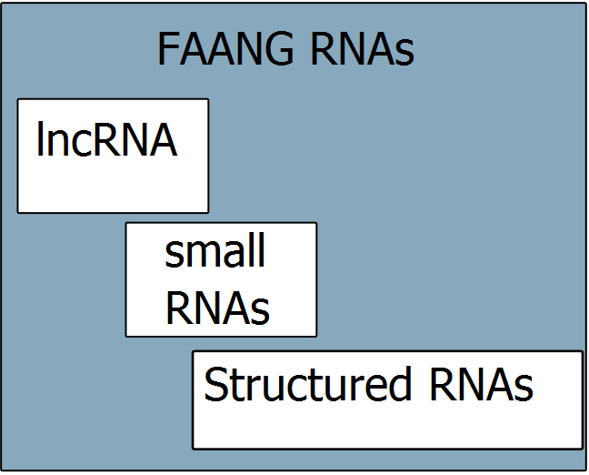
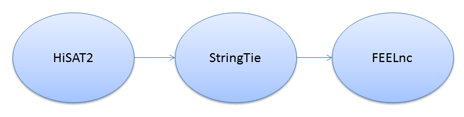
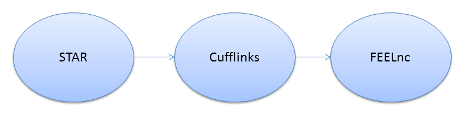

## FAANG-COST Hackathon I

* Jan Gorodkin organized a FAANG-COST hackathon in Copenhagen from 24.-25.11.2016

* The purpose was to initiate a community effort to establish a ncRNA database for farm animals

---

## FAANG-COST Hackathon II

* I present here the current state of the lncRNA subpart of it

* In total 12 persons are working at the moment in that subgroub and 25 in total for all different subgroups together

* The focus of the lncRNA group is currently on 5 different species:
      * cow
      * pig
      * horse
      * chicken
      * sheep

---

## Data collection and filtering

* RNA-seq raw datasets were collected from the European Nucleotide Archive (ENA)

* Team members also made own datasets available to the group

* Any experiment that met the following criteria was included into the collection

      * Illumina output only
      * Paired-end reads
      * At least 100bp
      * Strand specific libraries

---

## Quality control and Data curation

* All obtained raw files were quality controlled with 

    * FastQC
    * MultiQC
    * Tailored scripts (e.g. strandness validation)

* For all files, among others, the following meta-data were archived:
    
    * Tissue type (Brenda Ontology terms)
    * Corresponding references
    * ENA accession number
    * Experimental design
    

---

## Pipelines established

We established two different pipelines to annotate lncRNA:

The "HS" pipeline:

The "SC" pipeline:
    

---

## Used Genome Versions and available samples

| Species   |      Genome        |  Avail. Samples from ENA|
|-----------|:------------------:|----------------:|
| Chicken   |  Gallus_gallus-5.0 |   171           |
| Cow       |  UMD_3.1.1         |   447           |
| Horse     |  EquCab2.0         |    62           |
| Pig       |  Sscrofa11.1       |   149           |
| Sheep     |  Oar_v4.0          |   195           |

---

## Collected tissues per samples

---

## Pipeline comparison

* Sarah Djebali performed an extensive comparison on the two different pipelines for cow and chicken

* For that, we ran both pipelines with and without gene annotations

* Tissues were considered individually and also merged (1,2 and all)

* Total number of transcript sets to evaluate:

    * 1 gene annotation + 24 predictions for chicken
    * 1 gene annotation + 32 predictions for cattle

---

## Summary of the comparison

---

## Impacts of the comparisons

* Stringtie has improved a lot between version 1.3.2 and 1.3.3
  
* Many less unstranded transcripts
  
* Length of exons of different types better
  
* Less impacted by not having an annotation
  
* More similar results on both species

* Stringtie becomes a tool that can be envisionned for FAANG,
   although its results are more dependent on the annotation
   quality and this one can be very variable for livestock species

---

## FEELnc performance for our data

* Each pipeline produced one gtf as input for FEELnc

* The number of reads to do lncRNA annotation is also crucial and should be at least 70 Mio reads

* Most of the available datasets had less

* Consequently, we chose 30 Mio as threshold for a high-coverage set

* That means: 4 different input gtfs per species.

---

## FEELnc results I

| Species   |      Input    |  # of lncRNA     |
|-----------|:-------------:|-----------------:|
| Chicken   | HS            | 31.208           |
|           | HS30          | 10.225           |
|           | SC            | 46.288           |
|           | SC30          | 29.310           |
| Cow       | HS            | 26.231           |
|           | HS30          |  8.219           |
|           | SC            | 141.036          |
|           | SC30          | 41.980           |

---

## FEELnc results II

| Species   |      Input    |  # of lncRNA     |
|-----------|:-------------:|-----------------:|
| Horse     | HS            | 12.848           |
|           | HS30          | 9.159            |
|           | SC            | 77.668           |
|           | SC30          |  53.932          |
| Sheep     | HS            | 27.713           |
|           | HS30          |  6.270           |
|           | SC            | 49.724           |
|           | SC30          | 31.172           |

---

## Upcoming tasks

* Between tissue comparison for lncRNA expressions

* Between species comparison for lncRNA expressions

* Trace the reasons for differences in pipelines

* If possible, functional interpretation of the lncRNA

* Agree on publication strategy (Which ones? Similarity of lncRNA!)

* Perform a homolog analysis with existing and reported lncRNA

--- .ninety

## Vision for the FAANG non-coding and structured RNA (ncRNA) database

<ul>
<li> Compilation of small, long and structured RNA

<li> For multiple animal genomes
  <ul>
   <li> Syntenic ncRNAs
   <li> Tissue expression
   <li> QTL
   <li> Conservation of features
  </ul>
<li> Integration with ENSEMBL will feed into external resources e.g.:
  <ul>
   <li> The tissues database[*]
   <li> RAIN for RNA and protein interactions/associations [#]
  </ul>
</ul>

[*] https://tissues.jensenlab.org

[#] https://rth.dk/resources/rain

---

## Acknowledgement

|                   |             |   
|-------------------|---------------------|
|Jan Gorodkin       | Overall coordination and supervsion   |
|Alicja Pacholewska | lncRNA coordination    |
|Daniel Fischer     | lncRNA coordination       |
|Andreia Amaral     | sncRNA coordination   |
|Christian Anton    | structured RNA coordination    |

| lncRNA              | sncRNA            | structured RNA    |
|---------------------|-------------------|-------------------|
|Sarah Djebali        | Kisun Pokharel    | Jakob Havgaard    |
|Konstantinos Billis  | Ole Madsen        | Stefan Seemann    |
|Thomas Derrien       | Anne Hoffmann     | Mark Thomas       |
|Lel Eory             | Fiete Haack       | Ted Kalbfleisch   |
|Frank Panitz         | Jacques Lagnel    | Jose Gonzalez     |
|Nadezhda Doncheva    | Sylvain Marthey   |                   |
|Magda Mielczarek     |                   |                   |
|Christa Kühn        |                   |                   |
|Oana Palasca         |                   |                   | 

---

## Appendix: Chicken summary - individual

---

## Appendix: Chicken summary - merged

---

## Appendix: Cow summary - individual

---

## Appendix: Cow summary - merged

---

