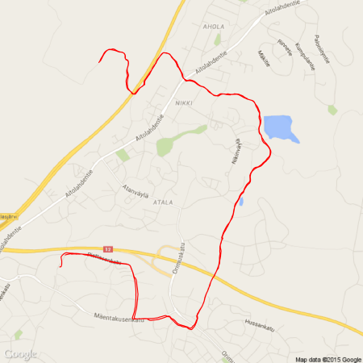

## Disclaimer

I do not have any affiliation with any of the presented tools!

---

## Overview

1. Required Tools

2. ...

--- .segue .dark

## Required Tools

---

## Required Tools

We make use of the following Tools/ R-packages

1. RStudio

2. GitHub

3. Slidify (including Markdown)

4. googleVis

---

## RStudio

* Supposedly all of you have heard about RStudio.

* First version (v0.92) of RStudio was published in February 2011.

* Back then there were plenty of competing R editors, but these days RStudio became the quasi standard.

* The popularity of RStudio is due to its large amount of included features.

* RStudio is available as desktop and server version.

* RStudio also powers 'Shiny', a web application framework for R.

* One not so common, but very useful feature is the project feature.

---

## GitHub

* Supposedly most of you also have heard about GitHub (or at least git)

* git is a revision control system, initially developed 2005 by Linus Torvalds for the Linux kernel.

* GitHub is a filehosting service (founded 2008) that is based on the git technology. 

* GitHub is designed especially for the development of larger software projects (branch, merge, fork). 

* It is getting more and more popular to keep R-packages only on GitHub and not to submit to Cran. 

* Researchers can apply for free private repositories via [GitHub education] (https://education.github.com/).

* GitHub provides webspace for webpages via [GitHub pages] (https://pages.github.com/).


---

## GitHub pages

* If you have a GitHub account, you could create a repository called 

_username_.github.io

* Then, you can reach your webpage via

[http://username.github.io](http://username.github.io)

* To make things work proper, you should create a file

index.html

in the uppest level of the repository. 

* Starting from there, you can have several subpages that can be stored in subfolders of your repository.
  
* It is advisable to name the entry page of ech subproject also index.html

---

## Setting up space for presentations on _GitHub pages_

* I recommend to use Linux, as this comes with practical all developer software installed. 

* If your IT doesn't allow Linux, you could e.g. install it on a VirtualBox parallel to Windows so that you can literally switch between OS as you switch between Tools.

* Connect your computer to GitHub by providing an SSH keypair (create it in RStudio and add it to the profile at GitHub), this makes life easier.

* A step-by-step tutorial for this is provided by GitHub [here] (https://help.github.com/articles/generating-ssh-keys/).

---

## Setting up the GitHub repository


---

## Cloning to RStudio I

* It is important to tick the box

_Initialize this repository with a README_

* Having an initial README file in the repository enables us to clone it without any further problems.

* From the repository we get then its address (either HTTPS, SSH or Subversion)

* For RStudio we should copy the SSH address, e.g. in my case:

git@github.com:fischuu/fischuu.github.io.git

* We start RStudio and create a new project.

---

## Cloning to RStudio II


--- 

## Cloning to RStudio III


--- 

## Cloning to RStudio IV

* In the dialog we choose 

  1. Version Control
  
  2. Git
  
  3. And then we provide the URL (as SSH) of the repository, the name and location on HDD
  
* Then, we click on _'Create Project'_

* RStudio clones into the repository creates the folder/file structure on the HDD

* Now we can create an own folder structure (e.g. _presentations_, _lectures_, etc.)

* After those steps, we have succesful connected RStudio with GitHub pages and we can control the repository entirely with RStudio.

---

## Cloning to RStudio V


--- 

## Starting a new presentation

* To create a new presentation, we run

```{r firstSteps, eval=FALSE}
library("slidify")
setwd("/home/ejo138/Projects/fischuu.github.io/presentations/")
author("MyFirstPresentation", use_git = FALSE)
```

* The part `use_git = FALSE` might be irritating, but it is needed, as _slidify_ would create otherwise a new git structure within 
   the existing one (what is possible but would lead to far for now.)

* Slidify then creates all required files and you are ready to go.

* To create slides with Slidify no HTML knowledge is required, as everything is done via R [Markdown](https://en.wikipedia.org/wiki/Markdown).

* Markdown is a lightweight markup language with plain text formatting that can be transformed into HTML (or other languages).

---

## Output of `author()`

* The function `author()` creates several files and folders in the working directory.

* The main folder is called as defined in the `author()` call.

* Within that folder, two more folders called `assets` and `libraries` are created.

* The main document is called `index.Rmd`

* `index.Rmd` contains two main code chunks. The header written in YAML defines the meta-information of the document.

* The body contains the slides and uses the R Markdown language.

---

## This is where we start (YAML header of index.Rmd)

```{r slidifyStart1, eval=FALSE, size="LARGE"}
---
title: "null"
author: "null"
highlighter: highlight.js
output: pdf_document
job: null
knit: slidify::knit2slides
mode: selfcontained
hitheme: tomorrow
subtitle: null
framework: io2012
widgets: []
---

## Read-And-Delete

1. Edit YAML front matter
...

```  

---

## This is where we start (body of index.Rmd)

```{r slidifyStart2, eval=FALSE}
...
hitheme: tomorrow
subtitle: null
framework: io2012
widgets: []
---

## Read-And-Delete

1. Edit YAML front matter
2. Write using R Markdown
3. Use an empty line followed by three dashes to separate slides!
--- .class #id 

## Slide 2

```  

---

## Markdown basics

* R markdown is a very simple markup language that makes creating slides extremely fast and easy.

* A reference overview can be found [here](http://rmarkdown.rstudio.com/authoring_basics.html)

* For example the [`index.Rmd`](https://github.com/fischuu/fischuu.github.io/raw/master/presentations/SlidifyYourPresentations/index.Rmd) of this presentation.

* Besides the markup part, R Markdown also accepts, evaluate and renders code chunks.

* Code chunks are indicated like this


        ```
        "Write your code here"
        ```

* After the first     ``` one can add {r, options=values} for syntax highlighting and further tuning parameters
        

---

## And then

* Slides are separated with ---

* For mathematical formulas you can use just normal LaTeX code.

* In that case yo uhave to add the _mathjax_ widget still to the JAML header.

* MathJax has become the gold standard for mathematics on the web, as the quality is close to what you expect from LaTeX.

* After the slides are ready they have to be 'slidified'.

* For that, just type
```{r eval=FALSE}
slidify('index.Rmd')
```

* ` slidify() ` creates then the ` *.md` and ` *.html` files on the HDD

* Eventually we can publish the slides by pushing the project to GitHub page


---

## Presenting in HTML using Slidify and R Markdown

* Instead of static content in pdf, you get all features you know from webpages.

* You can include interactive graphics, webcontents and even create easily interactive tests that write user feedback straigt into a database.

* Also, even if this is a matter of taste, different ways of slides are possible, like e.g. in [this](http://ramnathv.github.io/slidifyExamples/examples/impressjs) example.

* Publishing slides of GitHub brings all modern web features with it. (Issue report system, own Wiki-page, distributed working).

* We focused here on presentations with Slidify, but you can also create reports using R Markdown.

* In combination with [pandoc] (http://pandoc.org) you have then an extremely powerful tool that can prepare LaTex, pdf and docx documents just with one click.

* Pandoc functions are also included in the [knitR] (http://yihui.name/knitr/) package.

   
---

## Motivation for googleVis

* Due to R's age, some of its basic functions are not up-to-date anymore

* However, as R is modular, user keep developing new packages that improve the basic functionality

* One very popular R-library is [ggplot2](http://ggplot2.org/), that was presented earlier today

* Google has also a large library for programmers that includes different types of algorithms and graphical presentations

* Programmers can utilize the google libraries via standardized interfaces, so-called API's

* Some R-users have created now R-libraries that make the graphic functions provided by Google easily accessible via R

```{r setOptions, echo=FALSE}
library(googleVis)
op <- options(gvis.plot.tag='chart')
```

--- 

## Overview of googleVis

* [googleVis](http://code.google.com/p/google-motion-charts-with-r/) is a package for [R](http://www.r-project.org/) and provides an interface between R and the [Google Chart Tools](https://developers.google.com/chart/)

* The functions of the package allow users to visualise data with the Google Chart Tools without uploading their data to Google

* The output of googleVis functions is html code that contains the data and references to JavaScript functions hosted by Google

* To view the output a browser with an internet connection is required, the actual chart is rendered in the browser; some charts require Flash

* See also: **Using the Google Visualisation API with R**, 
  [The R Journal, 3(2):40-44, December 2011](http://journal.r-project.org/archive/2011-2/RJournal_2011-2_Gesmann+de~Castillo.pdf) and googleVis [package vignette](http://cran.r-project.org/web/packages/googleVis/vignettes/googleVis.pdf)

---

## Usage of googleVis

* The googleVis package is very user friendly and easy to use

* The most difficult part is to get the data to R (what is, with some practice also an easy task)

* A typical workflow would look like this:

```{r workflow, eval=FALSE}
library(googleVis)
myData <- data.frame(time = c("JAN", "FEB", "MAR"), 
                 val1 = c(10, 13, 14), 
                 val2 = c(23, 12, 32))
Line <- gvisLineChart(myData)
plot(Line)

```

--- .segue .dark

## Google Diagram Chart Tools

---

## Line chart example
  
```{r linechart, eval=FALSE}
plot(gvisLineChart(myData))
```

```{r linechart.intern, results='asis', echo=FALSE}
library(googleVis)
myData <- data.frame(time = c("JAN", "FEB", "MAR"), 
                 val1 = c(10, 13, 14), 
                 val2 = c(23, 12, 32))
plot(gvisLineChart(myData, options=list(width=950, height=520)))
```

---

## Column chart example
  
```{r columnchart, eval=FALSE}
plot(gvisColumnChart(myData))
```

```{r columnchart.intern, results='asis', echo=FALSE}
library(googleVis)
myData <- data.frame(time = c("US", "EUR", "ASIA"), 
                 val1 = c(10, 13, 14), 
                 val2 = c(23, 12, 32))
plot(gvisColumnChart(myData, options=list(width=950, height=520)))
```

---

## Candlestick chart example I

* Having stock-market data like this, Candlestick charts help to visualize the dynamic of the corresponding stock

```{r Exports data Candle, comment=NA}
print(OpenClose)
```

---

## Candlestick chart example II
  
```{r candlestickchart, eval=FALSE}
plot(gvisCandlestickChart(OpenClose))
```

```{r candlestickchart.intern, results='asis', echo=FALSE}
library(googleVis)
plot(gvisCandlestickChart(OpenClose, options=list(width=950, height=520)))
```

---


## Gauge chart example I

* Another very easy data set:

```{r Exports data Gauge, comment=NA}
print(CityPopularity)
```

---

## Gauge chart example II
  
```{r gaugechart, eval=FALSE}
plot(gvisGauge(CityPopularity, options=list(min=0, max=800, greenFrom=500,
                               greenTo=800, yellowFrom=300, yellowTo=500,
                               redFrom=0, redTo=300)))
```

```{r gaugechart.intern, results='asis', echo=FALSE}
library(googleVis)
plot(gvisGauge(CityPopularity, options=list(min=0, max=800, greenFrom=500,
                               greenTo=800, yellowFrom=300, yellowTo=500,
                               redFrom=0, redTo=300, width=850, height=420)))

```

--- .segue .dark

## Google Geo Chart Tools

---

## Geo chart example I

* Also plotting maps using googleVis is extremly easy

* The following data is enough to create an intensity map

```{r Exports data, comment=NA}
print(Exports)
```

---

## Geo chart example II

```{r intensitychart, eval=FALSE}
plot(gvisGeoChart(Exports, locationvar="Country", 
                 colorvar="Profit",
                 options=list(projection="kavrayskiy-vii")))
```

```{r intensitychart.intern, results='asis', echo=FALSE}
library(googleVis)
plot(gvisGeoChart(Exports, locationvar="Country", 
                 colorvar="Profit",
                 options=list(projection="kavrayskiy-vii", width=950, height=400)))

```

---


## Geo chart example III - Finland

```{r finland.data, results='asis', echo=FALSE}
set.seed(54235)
myData <- data.frame(state.name=c(paste("FI-",1:19,sep="")), Something=sample(1:1000,19))
```

```{r finland.data2, comment=NA}
head(myData)
```

* Countries can be encoded according to the [ISO 3166-2](https://en.wikipedia.org/wiki/ISO_3166-2) Norm 

* The districts in Finland are encoded according to the [ISO 3166-2:FI](https://en.wikipedia.org/wiki/ISO_3166-2:FI) Norm

---

## Geo chart example IV - Finland

```{r finlandint, eval=FALSE}
plot(gvisGeoChart(myData, "state.name", "Something",
     options=list(region="FI", displayMode="regions", 
     resolution="provinces")))


```{r finland, results='asis', echo=FALSE}
library(googleVis)
myData <- data.frame(state.name=c(paste("FI-",1:19,sep="")), Something=sample(1:1000,19))
GeoStates <- gvisGeoChart(myData, "state.name", "Something",
                          options=list(region="FI", 
                                       displayMode="regions", 
                                       resolution="provinces",
                                       width=900, height=400))
plot(GeoStates)

```

---

## Geo chart example V - Earthquakes in Oceania

```{r intensitychart2.intern, comment=NA}
data(quakes)
head(quakes)
```

---

## Geo chart example VI - Earthquakes in Oceania

```{r intensitychart3.intern, results='asis', echo=FALSE}
library(googleVis)
require(stats)
data(quakes)
quakes$latlong<-paste(quakes$lat, quakes$long, sep=":")
 
plot(gvisGeoChart(quakes, "latlong", "depth", "mag",
                   options=list(displayMode="Markers", region="009",
                   colorAxis="{colors:['red', 'grey']}",
                   backgroundColor="lightblue", width=950, height=500)))
```

---

## Geo chart example VII - My Running

```{r myRunning.data5, results='asis', echo=FALSE}
myRunning <- read.table("/home//ejo138/git//fischuu.github.io//presentations//RAndGoogleVisualization/runningData.Rda")
```

```{r myRunning.data6, comment=NA}
head(myRunning)
```


---

## Geo chart example VIII - My Running

```{r myRunning.data7, echo=TRUE, eval=FALSE}
plot(gvisMap(myRunning, "LatLong" , 
             options=list(mapType='terrain', useMapTypeControl=TRUE)))

```


```{r myRunningMap, results='asis', echo=FALSE}
library(googleVis)
myRunning <- read.table("/home//ejo138/git//fischuu.github.io//presentations//RAndGoogleVisualization/runningData.Rda", nrows =400)
plot(gvisMap(myRunning, "LatLong" , 
            options=list(mapType='terrain', useMapTypeControl=TRUE,
                         width=950, height=450)))
```

---

## Or exported as fixed map



--- .segue .dark

## Google Organisatorial Charts

---

## Google tables 

```{r myRunning.int.data7, echo=TRUE, eval=FALSE}
plot(gvisTable(Population, formats=list(Population="#,###",
                           '% of World Population'='#.#%'),
                           options=list(page='enable')))

```

```{r tables, results='asis', echo=FALSE}
library(googleVis)
PopTable <- gvisTable(Population, 
                      formats=list(Population="#,###",
                                  '% of World Population'='#.#%'),
                      options=list(page='enable', width=950, height=400))
plot(PopTable)

```

---

## Sankey plot - Example I


```{r Sankey data load, comment=NA, echo=FALSE}
dat <-  read.table("/home//ejo138/git//fischuu.github.io//presentations//RAndGoogleVisualization/sankeyData.Rda")
```

```{r Sankey data, comment=NA}
dat[1:10,]
```

---

## Sankey plot - Example II

```{r sankey.int, echo=TRUE, eval=FALSE}
plot(gvisSankey(dat, from="From", to="To", weight="Weight"))

```

```{r Sankey, results='asis', echo=FALSE}
library(googleVis)
dat <-  read.table("/home//ejo138/git//fischuu.github.io//presentations//RAndGoogleVisualization/sankeyData.Rda")

sk1 <- gvisSankey(dat, from="From", to="To", weight="Weight", options=list(page='enable', width=950, height=450))
plot(sk1)
```

--- .segue .dark

## Google Flash based Charts

---

## Motion chart example
  
```{r motionchartcodeWorldBank, results='asis', echo=FALSE}
library(googleVis)
worldBankData <- read.table("/home//ejo138/git//fischuu.github.io//presentations//RAndGoogleVisualization/worldBankData.Rda")
plot(gvisMotionChart(worldBankData, idvar="country.name", timevar="year", options=list(width=950, height=520)))
```

----

## How I created these slides

```{r slidify, eval=FALSE}
library(slidify)
author("RAndGoogleVisualization")
## Edit the file index.Rmd and then
slidify("index.Rmd")
```

* The slides have been created entirely using R

* The ready presentation is then hosted on Github, a free online repository for programming projects

* You can find the slides in my [repository](https://github.com/fischuu/fischuu.github.io/tree/master/presentations/RAndGoogleVisualization)

---

## Slidify: Embedding YouTube videos

<iframe width="420" height="315" src="http://www.youtube.com/embed/hVimVzgtD6w" frameborder="0" allowfullscreen></iframe>

---

## Slidify: Formulas via MathJax

\[ |\zeta - z - h| \geq \frac{1}{2} |\zeta - z|\] 

\[ \sum_{n=1}^k \frac{1}{n} ≻ \int_1^{k+1} \frac{1}{x} dx = \ln(k+1) \]

\[ f'(a)=\lim_{h\to 0}\frac{f(a+h)-f(a)}{h} \]

\[ \begin{bmatrix} 1 & 2\\ 3 & 4\\ \end{bmatrix} \begin{bmatrix} 0 & 1\\ 0 & 0\\ \end{bmatrix}= \begin{bmatrix} 0 & 1\\ 0 & 3\\ \end{bmatrix}  \]

--- &submitcompare2 rows:5

## Slidify: Interactive slides

The solid curve represents the distribution of heights of all males in the US. The dotted curve represents the distribution of heights reported by males on OkCupid, an online dating website.


*** =question

What is happening here?

*** .hint 
This is a hint

*** .explanation

It is easier to interpret things if we overlay a fitted normal distribution for the heights reported by males on OkCupid. Looking at the graph carefully, we can observe two things.


1. Males on OkCupid probably tend to inflate their heights!
2. You can also see a more subtle vanity at work: starting at roughly 5' 8", the top of the dotted curve tilts even further rightward. This means that guys as they get closer to six feet round up a bit more than usual, stretching for that coveted psychological benchmark.

---  &radio2

## Radio (Two Column)

What dimension is normal distributed?

1. X
2. _Y_

*** =image

```{r quiz1, results='asis', echo=FALSE}

plot(runif(100), rnorm(100))

```

*** .hint

Check the axis labels.


*** .explanation

Data in y direction are normal distributed.

---

## Conclusion

* googleVis is a very powerful package that creates appealing, interactive Graphics without big efforts

* The output is html based

* In combination with [slidify](http://slidify.org) a different class of presentations and assignments can be created

* Code and slides are written in plain text, no OS compatability problems will occur

* Slidify provides much more than just embedding th googleVis output

--- .segue .dark

## Thank you!
