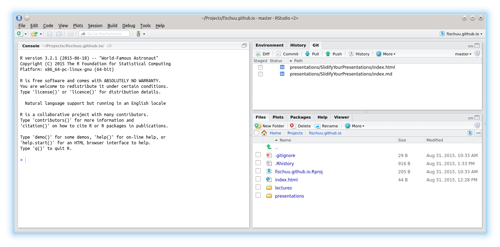

## Disclaimer

I do not have any affiliation with any of the presented tools!

---

## Overview

1. Required Tools

2. ...

--- .segue .dark

## Required Tools

---

## Required Tools

We make use of the following Tools/ R-packages

1. RStudio

2. GitHub

3. Slidify (including Markdown)

4. googleVis

---

## RStudio

* Supposedly all of you have heard about RStudio.

* First version (v0.92) of RStudio was published in February 2011.

* Back then there were plenty of competing R editors, but these days RStudio became the quasi standard.

* The popularity of RStudio is due to its large amount of included features.

* RStudio is available as desktop and server version.

* RStudio also powers 'Shiny', a web application framework for R.

* One not so common, but very useful feature is the project feature.

---

## GitHub

* Supposedly most of you also have heard about GitHub (or at least git)

* git is a revision control system, initially developed 2005 by Linus Torvalds for the Linux kernel.

* GitHub is a filehosting service (founded 2008) that is based on the git technology. 

* GitHub is designed especially for the development of larger software projects (branch, merge, fork). 

* It is getting more and more popular to keep R-packages only on GitHub and not to submit to Cran. 

* Researchers can apply for free private repositories via [GitHub education] (https://education.github.com/).

* GitHub provides webspace for webpages via [GitHub pages] (https://pages.github.com/).


---

## GitHub pages

* If you have a GitHub account, you could create a repository called 

_username_.github.io

* Then, you can reach your webpage via

[http://username.github.io](http://username.github.io)

* To make things work proper, you should create a file

index.html

in the uppest level of the repository. 

* Starting from there, you can have several subpages that can be stored in subfolders of your repository.
  
* It is advisable to name the entry page of ech subproject also index.html

---

## Setting up space for presentations on _GitHub pages_

* I recommend to use Linux, as this comes with practical all developer software installed. 

* If your IT doesn't allow Linux, you could e.g. install it on a VirtualBox parallel to Windows so that you can literally switch between OS as you switch between Tools.

* Connect your computer to GitHub by providing an SSH keypair (create it in RStudio and add it to the profile at GitHub), this makes life easier.

* A step-by-step tutorial for this is provided by GitHub [here] (https://help.github.com/articles/generating-ssh-keys/).

---

## Setting up the GitHub repository


---

## Cloning to RStudio I

* It is important to tick the box

_Initialize this repository with a README_

* Having an initial README file in the repository enables us to clone it without any further problems.

* From the repository we get then its address (either HTTPS, SSH or Subversion)

* For RStudio we should copy the SSH address, e.g. in my case:

git@github.com:fischuu/fischuu.github.io.git

* We start RStudio and create a new project.

---

## Cloning to RStudio II


--- 

## Cloning to RStudio III


--- 

## Cloning to RStudio IV

* In the dialog we choose 

  1. Version Control
  
  2. Git
  
  3. And then we provide the URL (as SSH) of the repository, the name and location on HDD
  
* Then, we click on _'Create Project'_

* RStudio clones into the repository creates the folder/file structure on the HDD

* Now we can create an own folder structure (e.g. _presentations_, _lectures_, etc.)

* After those steps, we have succesful connected RStudio with GitHub pages and we can control the repository entirely with RStudio.

---

## Cloning to RStudio V



--- 

## Starting a new presentation

* To create a new presentation, we run


```r
library("slidify")
setwd("/home/ejo138/Projects/fischuu.github.io/presentations/")
author("MyFirstPresentation", use_git = FALSE)
```

* The part `use_git = FALSE` might be irritating, but it is needed, as _slidify_ would create otherwise a new git structure within 
   the existing one (what is possible but would lead to far for now.)

* Slidify then creates all required files and you are ready to go.

* To create slides with Slidify no HTML knowledge is required, as everything is done via R [Markdown](https://en.wikipedia.org/wiki/Markdown).

* Markdown is a lightweight markup language with plain text formatting that can be transformed into HTML (or other languages).

---

## Output of `author()`

* The function `author()` creates several files and folders in the working directory.

* The main folder is called as defined in the `author()` call.

* Within that folder, two more folders called `assets` and `libraries` are created.

* The main document is called `index.Rmd`

* `index.Rmd` contains two main code chunks. The header written in YAML defines the meta-information of the document.

* The body contains the slides and uses the R Markdown language.

---

## This is where we start (YAML header of index.Rmd)


```r
---
title: "null"
author: "null"
highlighter: highlight.js
output: pdf_document
job: null
knit: slidify::knit2slides
mode: selfcontained
hitheme: tomorrow
subtitle: null
framework: io2012
widgets: []
---

## Read-And-Delete

1. Edit YAML front matter
...
```

---

## This is where we start (body of index.Rmd)


```r
...
hitheme: tomorrow
subtitle: null
framework: io2012
widgets: []
---

## Read-And-Delete

1. Edit YAML front matter
2. Write using R Markdown
3. Use an empty line followed by three dashes to separate slides!
--- .class #id 

## Slide 2
```

---

## Markdown basics

* R markdown is a very simple markup language that makes creating slides extremely fast and easy.

* A reference overview can be found [here](http://rmarkdown.rstudio.com/authoring_basics.html)

* For example the [`index.Rmd`](https://github.com/fischuu/fischuu.github.io/raw/master/presentations/SlidifyYourPresentations/index.Rmd) of this presentation.

* Besides the markup part, R Markdown also accepts, evaluate and renders code chunks.

* Code chunks are indicated like this


    ```
    "Write your code here"
    ```

* After the first     ``` one can add {r, options=values} for syntax highlighting and further tuning parameters
        

---

## And then

* Slides are separated with ---

* For mathematical formulas you can use just normal LaTeX code.

* In that case yo uhave to add the _mathjax_ widget still to the JAML header.

* MathJax has become the gold standard for mathematics on the web, as the quality is close to what you expect from LaTeX.

* After the slides are ready they have to be 'slidified'.

* For that, just type

```r
slidify('index.Rmd')
```

* ` slidify() ` creates then the ` *.md` and ` *.html` files on the HDD

* Eventually we can publish the slides by pushing the project to GitHub page (` Commit` and ` Push` )
